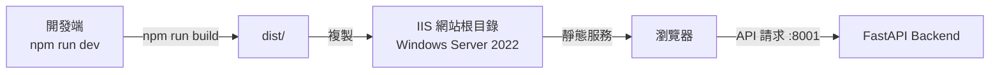
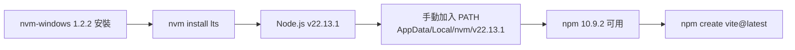
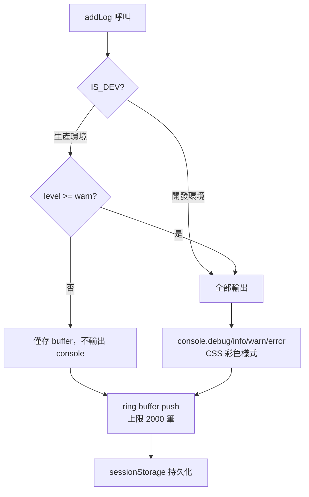
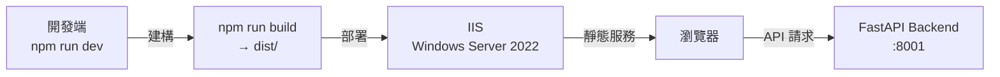
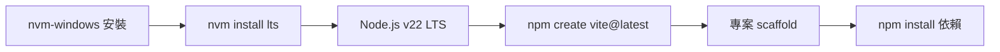
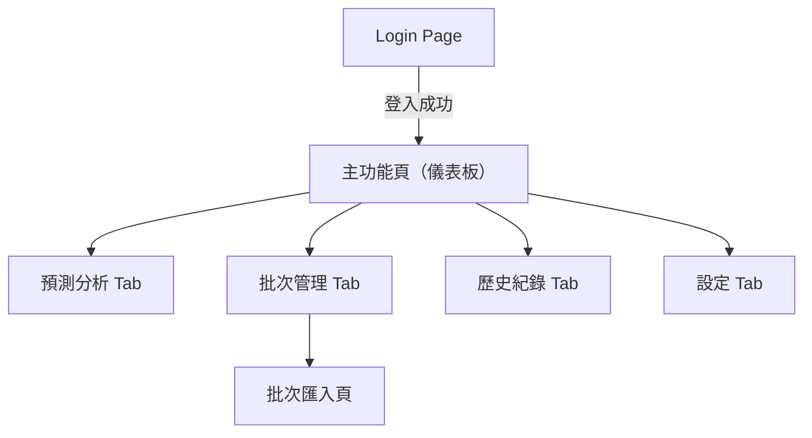
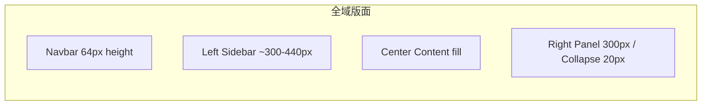
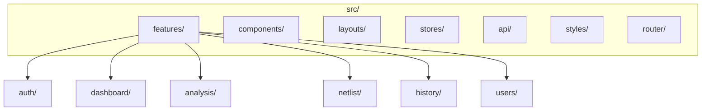

# ACT Failure Analysis System Frontend — 工作報告

> **專案名稱**：ACT Data Analysis System Frontend
> **報告期間**：2026-05-25 ~ 2026-05-29（W22）
> **負責人**：Dante

---

## 任務內容

本週為前端專案的**啟動週**，完成從零到可運行的完整初始化，包含環境建置、技術選型、專案 scaffold、設計系統與 Logger 模組。

### 本週主要工作項目

1. 閱讀後端 API Contract（`api-contract-structure.instructions.md`）與 UI/UX 設計文件
2. 初始化 Git 版本控制（master / Dante 分支策略）
3. 建立專案文件（`to-do-list.md`、`README.md`、`docs/reports/`）
4. 前端技術選型討論與確認（React 18 + TypeScript）
5. Windows Server 2022 Node.js 環境安裝（nvm-windows + Node v22.13.1 LTS）
6. Vite scaffold + 所有 production 依賴安裝
7. `src/` 目錄結構建立
8. 設計系統建立（Token、Ant Design 暗色主題、全域 CSS）
9. API 型別定義（`src/types/api.ts`）
10. Logger 模組實作（瀏覽器相容版本）

---

## 技術說明

### 確認技術選型

| 類別 | 選擇 | 版本 | 說明 |
|------|------|------|------|
| 框架 | React + TypeScript | 19.2.6 / 6.0.2 | 開發者已有經驗，生態系最大 |
| 建構工具 | Vite | 8.0.14 | 快速 HMR，React 官方推薦 |
| 狀態管理 | Zustand | 5.0.14 | 輕量，無 boilerplate |
| UI Library | Ant Design | 6.4.3 | 企業級，暗色主題完整 |
| 圖示 | lucide-react | 最新 | Lucide Icon 系列 |
| HTTP Client | Axios | 最新 | JWT Bearer Token + 統一錯誤處理 |
| 日期工具 | dayjs | 1.11.21 | 輕量，antd 依賴 |
| 傳統圖表 | ECharts（echarts-for-react）| 6.1.0 | 折線 / 柱狀 / 熱圖 |
| 疊層 Die 圖 | Cytoscape.js | 3.33.4 | 節點層次關係視覺化 |
| 路由 | React Router | 7.16.0 | SPA 路由 + 路由守衛 |

### 部署架構（Windows Server 2022）



**IIS 部署重點**：
- 啟用 IIS + URL Rewrite Module（SPA routing fallback）
- `web.config` 設定：所有路由 fallback to `index.html`
- 無需額外安裝 Apache，IIS 為 Windows Server 內建

### Node.js 環境安裝（Windows Server 2022）



**已知問題**：nvm-windows 的 symlink（`C:\nvm4w\nodejs`）可能因 settings.txt 路徑問題無效，以直接設定 PATH 方式繞過。

### src/ 目錄結構

```
src/
├── api/              # Axios client、API 呼叫函式
├── components/       # 共用 UI 元件
├── features/         # 功能模組（auth / dashboard / analysis / netlist / history / users）
├── layouts/          # 全域版面（MainLayout、Navbar、Sidebar）
├── router/           # React Router 設定
├── stores/           # Zustand 狀態管理
├── styles/           # 設計系統（tokens、antdTheme、全域 CSS）
├── types/            # TypeScript 型別定義
└── utils/
    └── logging/      # Logger 模組
```

### 設計系統（Design Tokens）

| 分類 | 內容 |
|------|------|
| 主色（Primary）| `#1890FF`（Ant Design Blue） |
| 背景色（Base）| `#0D1B2A`（Deep Navy） |
| 卡片背景 | `#1A2B3C` |
| 邊框色 | `#2A3F55` |
| 文字主色 | `#E8EDF2` |
| 成功色 | `#52C41A` |
| 警告色 | `#FFB74D` |
| 錯誤色 | `#FF5252` |

**TypeScript 6 注意事項**：Vite 8 預設啟用 `erasableSyntaxOnly`，`enum` 語法報錯（TS1294）。解決方式：改用 `as const` + type alias。

### Logger 模組設計（`src/utils/logging/`）



| 函式 | 說明 |
|------|------|
| `addLog({ level, module, stack, msg, user })` | 核心新增 log（與原版 Node.js logger 介面相同） |
| `getLogBuffer()` | 取得所有 log entries（供 UI 顯示） |
| `clearLogs()` | 清除記憶體與 sessionStorage |
| `downloadLogs()` | 下載 `YYYY-MM-DD.log` 至本機 |

**Log 格式**：
```
[2026-05-29 15:30:00.123] [INFO ] [dante] (localhost:5173 | auth/login): 登入成功
```

**保留原版設計**：呼叫介面、log 格式、每日 .log 檔名、四個 log 等級（debug/info/warn/error）

**改寫原因**：原版使用 `fs`、`os`、`path`、`chalk`、`graceful-fs`，全部為 Node.js 專屬 API，瀏覽器環境不可用。

### API 串接概覽

| 模組 | API 端點 | 說明 |
|------|----------|------|
| 認證 | `POST /api/v1/auth/login` | LDAP 登入，取得 JWT |
| 認證 | `GET /api/v1/auth/me` | 取得當前使用者資訊 |
| 資料查詢 | `GET /api/v1/data/search` | 查詢 Lot + HBIN 的 Fail 資料 |
| Netlist | `POST /api/v1/netlist/upload` | 上傳 Netlist Excel |
| Netlist | `GET /api/v1/netlist/programs` | 列出已上傳 Programs |
| 分析 | `GET /api/v1/analysis/fail-sample` | Fail Sample List 分析 |

---

## 成果總覽

| 檔案 / 目錄 | 說明 |
|-------------|------|
| `.gitignore` | Git 忽略規則（含 `.github/`、`node_modules/`、`dist/` 等） |
| `.gitattributes` | 統一換行符 `eol=lf`（解決 Windows CRLF 警告） |
| `README.md` | 專案說明文件初版 |
| `to-do-list.md` | 專案待辦事項清單 |
| `docs/reports/20260529_W22.md` | 本週工作報告 |
| `package.json` | 所有依賴（react / antd / zustand / axios / echarts / cytoscape 等） |
| `src/styles/tokens.ts` | 設計系統色彩 / 字型 / 間距 Token |
| `src/styles/antdTheme.ts` | Ant Design 暗色主題設定 |
| `src/index.css` | 全域樣式（Deep Navy 背景、捲軸樣式） |
| `src/types/api.ts` | 完整 API 型別定義（使用 `as const` 替代 `enum`） |
| `src/App.tsx` | ConfigProvider wrapper（套用暗色主題） |
| `src/utils/logging/index.ts` | 瀏覽器相容 Logger 模組 |
| `Git: master` | 初始 commit（文件） |
| `Git: Dante` | 技術選型文件更新 |
| `Git: Dante-feat-init-structure` | 專案初始化 + gitignore 修正 + 設計系統 + Logger（HEAD） |

---

## 後續行動

| # | 項目 | 說明 |
|---|------|------|
| 18 | Axios client | `src/api/client.ts`：JWT interceptor + 統一錯誤處理 + logger 整合 |
| 19 | Zustand auth store | `src/stores/authStore.ts`：token / user info / login / logout |
| 20 | React Router v6 | `src/router/index.tsx`：路由設定 + 路由守衛（未登入 redirect）|
| 4 | 全域版面 | `src/layouts/MainLayout.tsx`：Navbar + Sidebar + Content |
| 5 | Login 頁面 | `src/features/auth/LoginPage.tsx`：JWT 認證流程 |

---

## 任務內容

本週為前端專案的**啟動週**，主要任務為專案環境初始化與技術選型討論。

### 本週主要工作項目

1. 閱讀並整理後端 API Contract（`api-contract-structure.instructions.md`）
2. 閱讀 UI/UX 設計說明文件（`ui-ux-design.instructions.md`）
3. 初始化 Git 版本控制（master / Dante 分支）
4. 建立專案文件（`to-do-list.md`、`README.md`、`docs/reports/`）
5. 前端技術選型討論與確認

---

## 技術說明

### 確認技術選型

| 類別 | 選擇 | 說明 |
|------|------|------|
| 框架 | React 18 + TypeScript | 開發者已有經驗，生態系最大 |
| 建構工具 | Vite | 快速 HMR，React 官方推薦 |
| 狀態管理 | Zustand | 輕量，適合此專案規模 |
| UI Library | Ant Design 5.x | 企業級，暗色主題完整，Table/Form 豐富 |
| 圖示 | lucide-react | 設計稿指定 Lucide Icon 系列 |
| HTTP Client | Axios + Interceptor | JWT Bearer Token + 統一錯誤處理 |
| 傳統圖表 | ECharts（echarts-for-react）| 折線 / 柱狀 / 熱圖 |
| 疊層 Die 圖 | Cytoscape.js | 節點層次關係視覺化 |
| 路由 | React Router v6 | SPA 路由 + 路由守衛 |

### 部署架構（Windows Server 2022）



### 環境安裝順序



### IIS 部署設定

- 啟用 IIS（Windows 功能）
- 安裝 URL Rewrite Module（SPA 路由 fallback）
- `dist/` 複製至 IIS 網站根目錄
- 加入 `web.config` 處理 React Router fallback to `index.html`



### 全域版面骨架



### 前端模組規劃（初步）



### API 串接概覽

| 模組 | API 端點 | 說明 |
|------|----------|------|
| 認證 | `POST /api/v1/auth/login` | LDAP 登入，取得 JWT |
| 認證 | `GET /api/v1/auth/me` | 取得當前使用者資訊 |
| 資料查詢 | `GET /api/v1/data/search` | 查詢 Lot + HBIN 的 Fail 資料 |
| Netlist | `POST /api/v1/netlist/upload` | 上傳 Netlist Excel |
| Netlist | `GET /api/v1/netlist/programs` | 列出已上傳 Programs |
| 分析 | `GET /api/v1/analysis/fail-sample` | Fail Sample List 分析 |

---

## 成果總覽

| 檔案 / 目錄 | 說明 |
|-------------|------|
| `.gitignore` | Git 忽略規則 |
| `README.md` | 專案說明文件（初版） |
| `to-do-list.md` | 專案待辦事項清單（初版） |
| `docs/reports/20260529_W22.md` | 本週工作報告 |
| `Git: master` | 初始 commit |
| `Git: Dante` | 開發分支 |

---

## 後續行動

| 項目 | 說明 |
|------|------|
| 技術選型確認 | 與 Dante 確認框架（Vue 3 / React）、UI Library、狀態管理等 |
| 專案 scaffold | 依技術選型使用 Vite 初始化專案 |
| 設計系統建立 | 依 UI/UX 文件建立色彩、字型、元件 token |
| 路由與版面 | 建立 Navbar、Sidebar、全域 Layout 骨架 |
| 登入頁實作 | Login Page + JWT 認證流程 |
