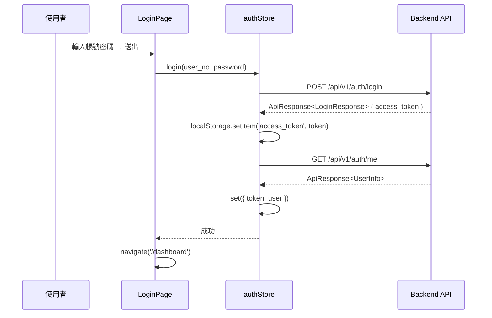
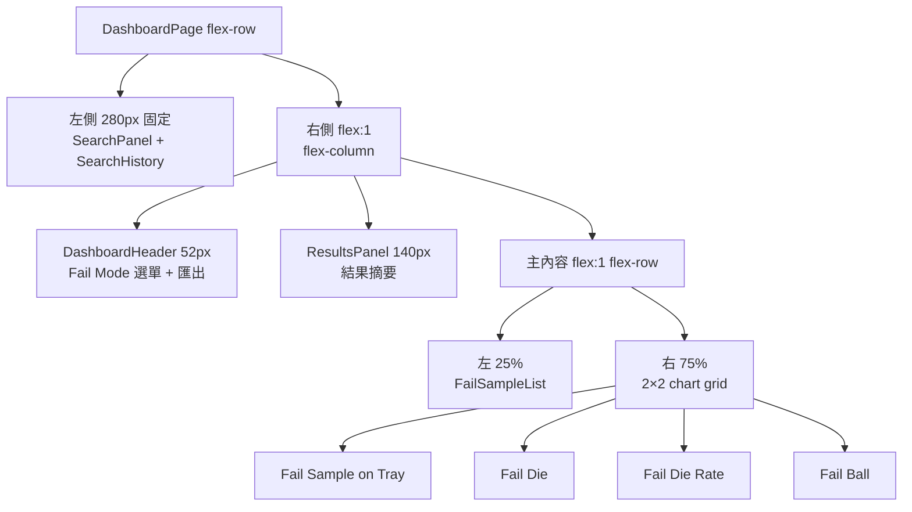

# ACT Failure Analysis System Frontend — 工作報告

> **專案名稱**：ACT Data Analysis System Frontend
> **報告期間**：2026-06-01 ~ 2026-06-06（W23）
> **負責人**：Dante

---

## 任務內容

本週完成 **Auth 基礎設施**，包含 Axios client、Zustand auth store、React Router 路由守衛、MainLayout 版面骨架、LoginPage 介面，並修正測試過程中發現的三個錯誤。同時完成 **Dashboard 功能第一期（Dante-feat-dashboard 分支）** 開發，包含 Fail Sample List 全部元件、狀態管理與一系列 UI 細節優化。

### 本週主要工作項目

1. Axios client 實作（JWT Bearer interceptor + 統一錯誤處理 + logger 整合）
2. Zustand auth store（login / logout / restoreSession）
3. React Router v7 設定 + 路由守衛（PrivateRoute）
4. MainLayout 版面骨架（Navbar 64px + Sider 320px + Content）
5. LoginPage 介面實作（Activity logo + icon prefix + 無紅色星號）
6. 修正 422 錯誤（LoginRequest 欄位名稱錯誤）
7. 修正 401 錯誤（ApiResponse 型別與 token 取值錯誤）
8. 登入效能問題診斷（確認為公司網路問題，程式碼無誤）
9. **[Dashboard]** API 層：`analysis.ts` (getFailSample)、`data.ts` (searchByLotAndHbin)
10. **[Dashboard]** Zustand dashboardStore（Promise.allSettled × 4 HBIN、搜尋歷史 20 筆、localStorage persist、預設 HBIN=3 Short）
11. **[Dashboard]** 全部 UI 元件：SearchPanel、SearchHistory、DashboardHeader、FailSampleList、PlaceholderChart、ResultsPanel
12. **[Dashboard]** DashboardPage 版面（左 280px 搜尋欄 + 右側彈性欄；右側：DashboardHeader → ResultsPanel 140px → 主內容 25%:75%）
13. **[Dashboard]** FailSampleList UI 細節優化：
    - CSS override 強制 `tbody` 固定高度 520px（`scroll.y` 只控制 max-height 問題的解法）
    - Table 永遠渲染，所有空值/錯誤狀態由 `locale.emptyText` 顯示
    - `showSizeChanger={false}` 移除無效頁數下拉選單
    - 統計資訊（DUT × Fail × Ball）移至 Card `extra` prop（title 右側）
    - SearchHistory Badge 統一為綠色（`#52c41a`）
14. **[Dashboard]** 修正 dashboardStore addLog 呼叫格式、authStore MOCK_USER 型別缺漏、vite.config.ts defineConfig 來源、logging.test.ts global 型別

---

## 技術說明

### Auth 流程



### FailSampleList 固定高度技術說明

**問題**：Ant Design Table 的 `scroll={{ y: 520 }}` 只設定 `.ant-table-body { max-height: 520px }`，資料列少時 tbody 仍會縮小。

**解法**：注入 scoped CSS override，搭配 wrapper className 避免污染其他 Table：

```tsx
// FailSampleList.tsx 內
<Card className="fsl-table-wrap" ...>
  <style>{`
    .fsl-table-wrap .ant-table-body {
      height: 520px !important;
    }
  `}</style>
  <Table scroll={{ y: TABLE_SCROLL_Y }} locale={{ emptyText: emptyDescription }} ... />
</Card>
```

**空值處理**：Table 永遠保持在 DOM 中（不 conditional render），所有空值/載入/錯誤狀態透過 `locale.emptyText` 顯示，Loading 透過 `loading={isSearching}` prop 處理。

### DashboardPage 版面結構



### Ant Design Pagination showSizeChanger

當 `total > 50` 時 Ant Design 預設顯示頁數下拉選單（showSizeChanger=true），但若未實作 `onShowSizeChange`，此下拉無任何作用。解法：明確設定 `showSizeChanger={false}`。

| 問題 | 原因 | 修正 |
|------|------|------|
| **422 Unprocessable Content** | `LoginRequest` 欄位名稱為 `employee_id`，後端要求 `user_no` | 修正型別定義與 authStore 呼叫 |
| **401 Unauthorized（getMe）** | `apiClient.post<LoginResponse>` 導致 `data.access_token` 取到 `undefined`，以 `Bearer undefined` 呼叫 getMe | 改用 `ApiResponse<LoginResponse>` 型別，取值改為 `data.data!.access_token` |
| **LoginPage UI** | 紅色必填星號（UX 不適合）、Input 無 icon 前綴 | `requiredMark={false}`、加入 user.png / lock.png prefix |

### API 回應包裝格式

```typescript
// 後端所有 API 回應均包裝在 ApiResponse<T>
interface ApiResponse<T> {
  code: number;
  message: string;
  data: T;
}

// 正確的取值方式
const { data: loginResp } = await apiClient.post<ApiResponse<LoginResponse>>('/auth/login', ...);
const token = loginResp.data!.access_token;  // response.data.data.access_token
```

### 登入效能診斷

| 量測工具 | POST /auth/login | GET /auth/me |
|----------|-----------------|--------------|
| Browser DevTools Network | 305 ms | 61 ms |
| DB audit_log | 58 ms | 6 ms |

**結論**：程式碼沒有效能問題，先前 21 秒為公司網路瞬間問題，非程式碼 bug。

### 路由架構

```mermaid
graph LR
    A[/] --> B{有 token?}
    B -->|否| C[/login → LoginPage]
    B -->|是| D[/dashboard → DashboardPage]
    C -->|登入成功| D
    D -->|登出| C
```

---

## 成果總覽

| 檔案 | 說明 |
|------|------|
| `src/api/client.ts` | Axios instance，JWT Bearer interceptor，401/403/5xx 統一處理 |
| `src/api/auth.ts` | `login()` / `getMe()` API 函式（ApiResponse 型別正確） |
| `src/stores/authStore.ts` | Zustand auth store（login / logout / restoreSession + persist） |
| `src/router/index.tsx` | createBrowserRouter（/login, /dashboard） |
| `src/router/PrivateRoute.tsx` | 路由守衛（無 token → redirect /login） |
| `src/layouts/MainLayout.tsx` | Navbar(64px) + Sider(320px) + Content 骨架 |
| `src/features/auth/LoginPage.tsx` | 登入頁（Activity logo、icon prefix、無紅色星號） |
| `src/features/dashboard/DashboardPage.tsx` | 儀表板主頁（左 280px 搜尋 + 右 flex 欄；ResultsPanel 140px 中層；主內容 25%:75%） |
| `src/stores/dashboardStore.ts` | Dashboard Zustand store（搜尋、歷史、cache、HBIN 選擇、預設 HBIN=3 Short） |
| `src/api/analysis.ts` | getFailSample(lotId, hbin) |
| `src/api/data.ts` | searchByLotAndHbin（未來使用） |
| `src/features/dashboard/components/SearchPanel.tsx` | LOT ID 搜尋欄 |
| `src/features/dashboard/components/SearchHistory.tsx` | 搜尋歷史列表（20 筆，Badge 統一綠色） |
| `src/features/dashboard/components/DashboardHeader.tsx` | Fail Mode 下拉（預設 Short=3）+ 匯出按鈕 |
| `src/features/dashboard/components/FailSampleList.tsx` | Fail Sample List 表格（固定高度 520px、統計至標題右側、showSizeChanger=false） |
| `src/features/dashboard/components/PlaceholderChart.tsx` | 四個未來圖表的佔位卡片 |
| `src/features/dashboard/components/ResultsPanel.tsx` | 結果摘要區塊（140px 固定高度） |
| `Git: Dante-feat-dashboard` | Dashboard 功能分支（第一期 UI 完成）|

---

## 後續行動

| # | 項目 | 說明 |
|---|------|------|
| 6 | 主儀表板頁（第二期） | 其餘 4 個圖表元件（Fail Sample on Tray、Fail Die、Fail Die Rate、Fail Ball） |
| 11 | Netlist 管理頁 | 上傳、列表 |
| 23 | Dashboard 單元測試 | dashboardStore、FailSampleList 單元測試 |
| — | Merge dashboard branch | `Dante-feat-dashboard` → `Dante` → push |

---
