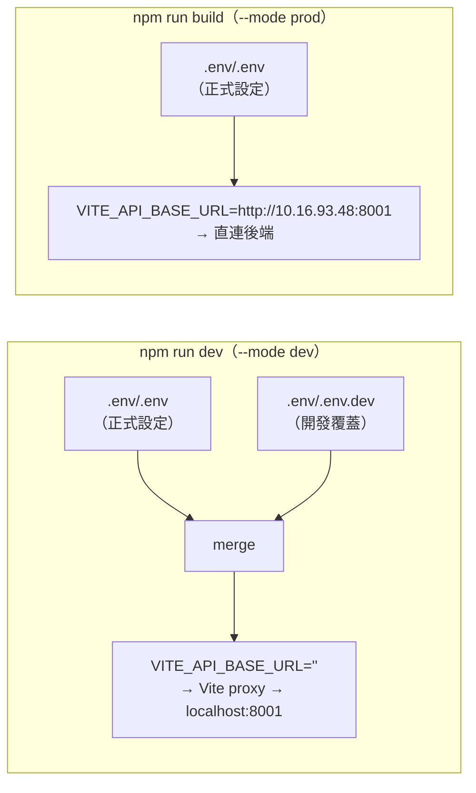
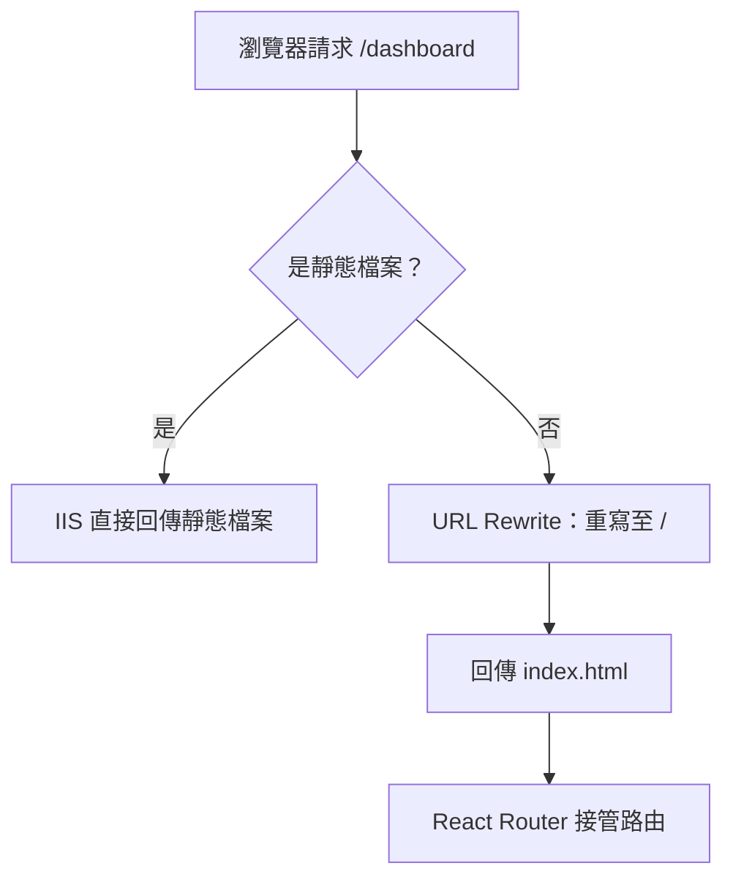
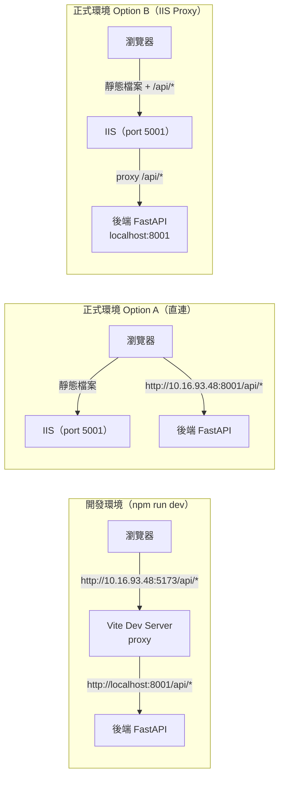

# ACT Failure Analysis System Frontend — 工作紀錄 W24

> 專案名稱：ACT Failure Analysis System Frontend
> 報告期間：2026-06-09（W24）
> 負責人：Dante

---

## 任務內容

本週為第一階段功能完成後的 **Release 準備週**，主要任務包含：

1. Release 前程式審查與問題修正
2. 環境變數設定架構建立（`.env/` 資料夾）
3. IIS 佈署文件與 SPA 路由設定（`public/web.config`）
4. 正式版本 release 流程（merge → Dante → 佈署）

---

## 技術說明

### 環境變數設定架構

Vite 的 env 載入邏輯（`envDir: '.env'`）：

- `.env/.env`：正式環境設定，`VITE_API_BASE_URL=http://10.16.93.48:8001`
- `.env/.env.dev`：開發覆蓋，`VITE_API_BASE_URL=`（空字串，走 Vite proxy）
- `vite.config.ts`：加入 `envDir: '.env'`，以 `loadEnv` 讀取 `DEV_API_TARGET` 設定 proxy target

### IIS SPA 路由設定

SPA（Single Page Application）所有路由都由前端 React Router 處理，IIS 預設會對非根目錄的 URL 回傳 404。`public/web.config` 加入 URL Rewrite 規則解決此問題：

**web.config 主要規則：**
- `SPA Routes`：非靜態檔案 → rewrite 到 `/`（index.html）
- `API Reverse Proxy`（選用 Option B）：`/api/*` → proxy 到 `localhost:8001`

### API 連線架構

---

## 成果總覽

| 類型 | 檔案 / 目錄 | 說明 |
|------|-------------|------|
| 新增 | `.env/` | 環境變數資料夾（gitignored） |
| 新增 | `.env/.env` | 正式環境變數 |
| 新增 | `.env/.env.dev` | 開發環境覆蓋變數 |
| 新增 | `public/web.config` | IIS SPA 路由設定（build 時自動複製到 dist/） |
| 新增 | `docs/deployment/iis-deployment.md` | IIS 佈署完整指南 |
| 修改 | `vite.config.ts` | 加 `envDir`、`loadEnv`、functional config |
| 修改 | `package.json` | dev/build scripts 加 `--mode dev/prod` |
| 修改 | `src/features/auth/LoginPage.tsx` | 修正標題 → "ACT Failure Analysis System" |
| 修改 | `.github/instructions/project-docs.instructions.md` | docs/reports → docs/records |
| 修改 | `.github/instructions/project-overview.instructions.md` | 補充 docs/records / docs/deployment |
| 修改 | `to-do-list.md` | 新增 #26 #27，更新修改紀錄 |

---

## 後續行動

| 優先度 | 項目 |
|--------|------|
| 🔴 | 執行 `npm run build` 驗證正式 build 正常 |
| 🔴 | merge `Dante-feat-dashboard` → `Dante` → 佈署至 IIS |
| 🟠 | 第二階段：Fail Sample on Tray 圖表元件 |
| 🟠 | 第二階段：Fail Die / Fail Die Rate 圖表元件 |
| 🟠 | 第二階段：Fail Ball 圖表元件 |
| 🟡 | Netlist 管理頁（上傳、列表） |
