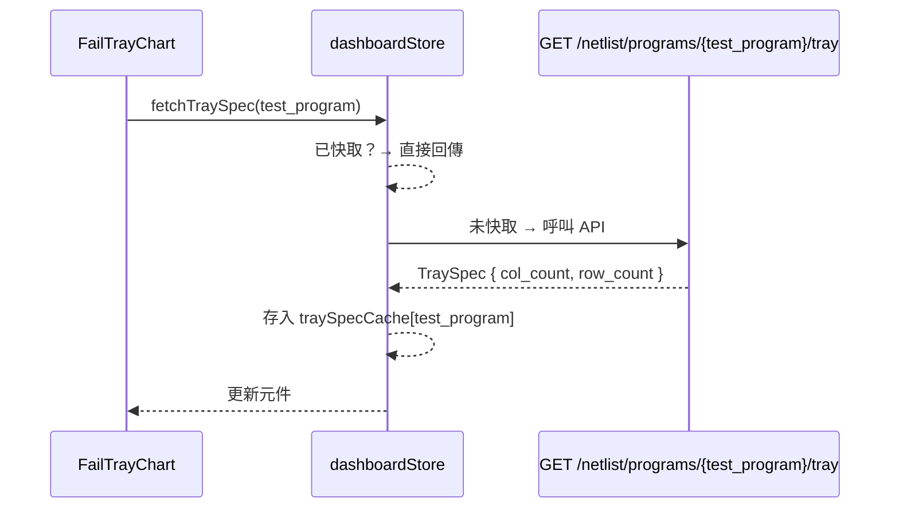

# ACT Failure Analysis System Frontend — 工作紀錄 W25–W27

> 專案名稱：ACT Failure Analysis System Frontend
> 報告期間：2026-06-16 ～ 2026-06-30（W25–W27）
> 負責人：Dante

---

## 任務內容

本期間為 **Dashboard 第二階段圖表開發週**，主要任務包含：

1. FailBallChart — Fail Ball 分佈圖實作（ECharts 水平柱狀圖，IO/POWER 切換）
2. FailTrayChart — Fail Sample on Tray 圖表實作（CSS Grid 位置圖，多頁導航）
3. Dashboard 4 個圖表全部上線，替換 PlaceholderChart
4. Dark/Light 主題 tooltip 統一修正
5. 圖表卡片標題格式統一（改顯示 HBin 類型而非 Lot ID）

---

## 技術說明

### FailBallChart — Fail Ball 分佈圖

使用 ECharts（`echarts-for-react`）繪製水平柱狀圖，顯示失效 BGA Ball Name 前 10 名：

- IO / POWER 切換（Segmented），共用 `calcTopBalls()` 計算邏輯
- Top 1 Bar 以橘色（`#F5C6A0`）高亮，其餘藍色（`#5BA4D5`）
- 暗色 tooltip（`COLOR_TOOLTIP_BG = '#1A2332'`），不隨主題切換（ECharts tooltip 固定深色）
- X 軸：Fail Count (ea)；Y 軸：Ball Name（自動截短超過 10 個字元）


---

### FailTrayChart — Fail Sample on Tray 圖表

以 CSS Grid 繪製 Tray 盤位置圖，每個格子對應一個 DUT 位置：

#### 資料流

```mermaid
flowchart TD
    DS[dashboardStore.search] -->|fail_sample| DA[computeAnalysis]
    DA -->|ioPinFailItems + dieResults| BTP[buildTrayPages]
    DS -->|fetchTraySpec| TSC[traySpecCache]
    TSC -->|TraySpec.col_count × row_count| BTP
    DS -->|total_qty| BTP
    BTP -->|TrayCell[][]| Grid[CSS Grid Tray 圖]
```

#### 著色邏輯

| 狀態 | 條件 | 顏色 |
|------|------|------|
| orange | DUT 在 `ioPinFailItems`，且其 ball_name 在 `dieResults.balls`（Top Die Fail） | `#F5C6A0` |
| blue | DUT 在 `ioPinFailItems`，但 ball_name 不在 `dieResults.balls`，或不在 `ioPinFailItems` 的真實 DUT | `#5BA4D5` |
| gray | 超出 `total_qty` 的補位格（dutNo=0） | dark `#2A3F52` / light `#D8E8F4` |

> **設計決策**：真實 DUT 位置（dutNo > 0）不在 ioPinFailItems 時視為藍色（Fail Sample，只是無 IO ball 資訊），而非灰色。只有超出 total_qty 的補位格才顯示灰色。

#### 佈局

```
┌──────────────────────────────────────────────────┐
│ 圖例：橘 = Top 1 Fail  藍 = Fail Sample  灰 = — │
│                                                  │
│  R ┌─────────────────────────────────────────┐  │
│  o │  □ □ □ □ □ □ □      (CSS Grid)          │  │
│  w │  □ □ □ □ □ □ □                          │  │
│  ( │  ...                                    │  │
│  N │                                         │  │
│  ) └─────────────────────────────────────────┘  │
│          Col(N)            ‹ 1 / 3 ›            │
└──────────────────────────────────────────────────┘
```

- Y 軸左側顯示 `Row(N)`（旋轉 -90°）
- X 軸下方顯示 `Col(N)`，右側顯示分頁導航（`‹ 1/N ›`），僅多頁時出現
- 每格 `border: 1px solid colorMode.border`，讓格線清晰可見

#### Tooltip 主題處理

Ant Design `<Tooltip>` 預設顏色不隨 dark/light 切換，需手動指定：

```tsx
<Tooltip
  color={colorMode.card}           // dark: #112240 / light: #FFFFFF
  overlayInnerStyle={{ color: colorMode.textPrimary }}  // dark: #FFF / light: #1A2332
>
```

#### Tray 規格 API 懶加載



---

### 設計討論過程：Tray 著色來源的演進

FailTrayChart 的著色資料來源經歷三個版本的討論修正：

| 版本 | 方法 | 問題 |
|------|------|------|
| v1 | 以 `total_qty` 為格子總數，`fail_sample` 對應位置 | 頁數計算正確但顏色分組邏輯待確認 |
| v2 | 改以展開的 FailSampleList 筆數（per ball_name）計算格子 | 頁數計算結果仍不正確，誤解資料格式 |
| v3（最終） | 回歸 `ioPinFailItems`（來自 `computeAnalysis`）+ `total_qty`，位置對應 `dut_no` | 與產線人員確認後的正確邏輯 |

> **關鍵差異**：FailSampleList UI 會將每個 ball_name 展開為一筆顯示（354 IO 筆 ≠ 354 個 DUT），但 Tray 圖應以「實際 DUT 數量」（`total_qty`）為格子總數，`ioPinFailItems` 僅用於確認哪些 DUT 有 IO fail 紀錄及其 ball_name。

---

### 圖表卡片標題格式統一

原本所有圖表標題顯示當前 Lot ID（`— 13NFSAB001`），修改為顯示 HBin 類型（`— Short`），讓標題資訊更有意義：

```tsx
// Before
const title = `Fail Ball${currentLotId ? ` — ${currentLotId}` : ''}`;

// After
const title = `Fail Ball${currentHbin ? ` — ${HBinLabel[currentHbin]}` : ''}`;
```

影響元件：`FailBallChart`、`FailDieChart`、`FailDieRateChart`、`FailTrayChart`

---

## 成果總覽

| 類型 | 檔案 | 說明 |
|------|------|------|
| 新增 | `src/features/dashboard/components/FailBallChart.tsx` | Fail Ball ECharts 水平柱狀圖 |
| 新增 | `src/features/dashboard/components/FailTrayChart.tsx` | Fail Sample on Tray CSS Grid 圖 |
| 新增 | `src/api/netlist.ts` → `getTray()` | GET /netlist/programs/{program}/tray |
| 修改 | `src/stores/dashboardStore.ts` | 新增 traySpecCache / fetchTraySpec / getTraySpec |
| 修改 | `src/features/dashboard/utils/analysisHelpers.ts` | computeAnalysis 回傳 ioPinFailItems；buildTrayPages 改為位置制 |
| 修改 | `src/features/dashboard/DashboardPage.tsx` | PlaceholderChart → FailTrayChart |
| 修改 | `src/features/dashboard/components/ResultsPanel.tsx` | 移除未使用 Badge import |
| 修改 | `src/features/dashboard/components/FailBallChart.tsx` | 標題改 HBinLabel、grid 微調 |
| 修改 | `src/features/dashboard/components/FailDieChart.tsx` | 標題改 HBinLabel |
| 修改 | `src/features/dashboard/components/FailDieRateChart.tsx` | 標題改 HBinLabel、grid 微調 |
| 修改 | `tests/unit/analysisHelpers.test.ts` | 更新 buildTrayPages 測試（位置制語意）|
| 修改 | `tests/unit/dashboardStore.test.ts` | 補 getFailSamplePower / netlist mock |

**測試狀態**：68 tests 全部通過（`npm run test:run`）
**Build 狀態**：TypeScript 型別檢查通過（`npm run build`）

---

## 後續行動

| 優先度 | 項目 |
|--------|------|
| 🟠 | merge `Dante-feat-fail-tray-chart` → `Dante` → 佈署更新 |
| 🟡 | Netlist 管理頁（上傳、列表、test_program 版本管理） |
| 🔵 | 歷史紀錄頁 |
| 🔵 | 使用者管理頁（admin） |
