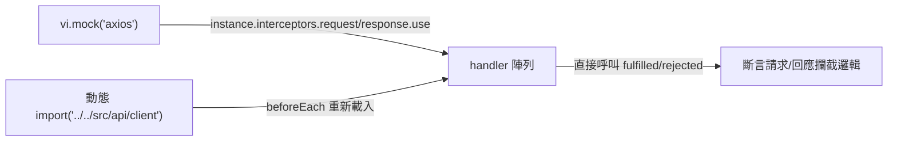
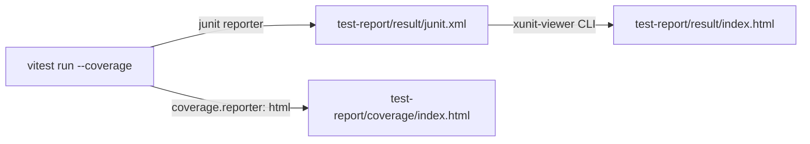

# ACT Failure Analysis System Frontend — 工作紀錄 W31

> 專案名稱：ACT Failure Analysis System Frontend
> 報告期間：2026-07-29（W31）
> 負責人：Dante

---

## 任務內容

準備 **release v1.5.0**（`Dante-release-v1.5.0` 分支），任務範圍為單元測試盤點與補強：

1. 盤點現有單元測試與目前程式碼的落差，找出未受測試覆蓋的高風險模組
2. 補齊缺漏的單元測試
3. 導入覆蓋率報告工具，並僅對關鍵 service / model 設定覆蓋率門檻
4. 導入可離線瀏覽的靜態測試結果報告工具

---

## 技術說明

### 測試缺口盤點

盤點前狀態：5 個測試檔案、66 個測試。找出以下缺口：

| 模組 | 缺口 |
|------|------|
| `src/api/client.ts` | 全站風險最高（JWT 主動/被動刷新攔截器、併發佇列、強制登出），**零測試** |
| `src/stores/themeStore.ts` | 簡單 persist store，零測試 |
| `src/router/PrivateRoute.tsx` | 路由守衛，零測試 |
| `calcTopBalls()`（`analysisHelpers.ts`） | 純函式，`FailBallChart`/`ResultsPanel` 共用邏輯，零測試 |
| `dashboardStore.ts` | 缺 `getCurrentFailSamplePower()`、`removeFromHistory()`、`fetchTraySpec()`/`getTraySpec()`、`hasAnyFail` 判斷、POWER 快取寫入場景 |

Dashboard 圖表元件（`FailBallChart`/`FailDieChart`/`FailDieRateChart`/`FailTrayChart` 等）因需大量 mock ECharts/Cytoscape，投入產出比低，維持不測試。

### client.ts 攔截器測試策略

`apiClient = axios.create(...)` 於模組載入時掛載攔截器，測試作法：



- 以 `makeJwt(expSecondsFromNow)` 建立假 JWT（`header.payload.signature`），測試主動刷新（剩餘 < 5 分鐘）判斷邏輯
- 401 被動刷新 + 併發佇列（`pendingQueue`）+ `forceLogout()`
- **除錯重點**：`forceLogout()` 內部使用「不等待」的動態 `import('../stores/authStore').then(...)`（fire-and-forget），測試斷言 mock 是否被呼叫時需先 `await vi.waitFor(() => expect(mockLogout).toHaveBeenCalled())` 讓微任務排空，否則斷言會搶在 `.then()` 回呼前執行而失敗

### 覆蓋率門檻設計

覆蓋率工具：`@vitest/coverage-v8`（provider: v8）。僅對關鍵模組設定門檻（圖表元件不強制）：

```typescript
thresholds: {
  'src/api/client.ts': { statements: 85, branches: 65, functions: 75, lines: 85 },
  'src/stores/**/*.ts': { statements: 85, branches: 65, functions: 75, lines: 85 },
  'src/features/dashboard/utils/**/*.ts': { statements: 85, branches: 65, functions: 75, lines: 85 },
  'src/router/PrivateRoute.tsx': { statements: 85, branches: 65, functions: 75, lines: 85 },
}
```

門檻數值依現況微調（如 `client.ts` branch 覆蓋率實測 74.35%，故 branches 門檻設 65% 而非 90%）。已手動驗證：故意調高門檻至 99% 會產生 `ERROR: Coverage for ... does not meet threshold` 並使指令以 exit code 1 失敗，確認門檻機制確實生效。

### 測試報告工具選型（重要討論）

原先採用 Vitest 內建 `reporters: ['default', 'html']`（需 `@vitest/ui`），但此為 SPA 架構，內部以 `fetch` 讀取 gzip 壓縮的 meta 資料，瀏覽器基於安全性限制不允許 `file://` 協定發出 fetch，**必須額外執行 `npx vite preview` 架設本地伺服器才能瀏覽**，與覆蓋率報告（Istanbul 產出，純靜態、雙擊即開）的使用體驗不一致，且需多開一個伺服器不便於直接截圖存檔。

改採 **`xunit-viewer`**：Vitest 改用內建 `junit` reporter 輸出 `junit.xml`，再由 `xunit-viewer` CLI 轉換為單一自包含靜態 HTML，雙擊即可開啟，符合截圖／存檔／貼 PPT 的使用情境。



輸出目錄整併於 `test-report/` 底下（`result/` 測試結果、`coverage/` 覆蓋率），避免各自散落在根目錄；`.gitignore` 排除整個 `test-report/`。

---

## 成果總覽

| 類型 | 檔案 | 說明 |
|------|------|------|
| 新增 | `tests/unit/client.test.ts` | JWT 攔截器測試（12 tests） |
| 新增 | `tests/unit/themeStore.test.ts` | themeStore 測試（4 tests） |
| 新增 | `tests/components/PrivateRoute.test.tsx` | 路由守衛測試（2 tests） |
| 修改 | `tests/unit/analysisHelpers.test.ts` | 新增 `calcTopBalls()` 測試（8 tests） |
| 修改 | `tests/unit/dashboardStore.test.ts` | 新增 16 個測試（POWER getter、removeFromHistory、TraySpec、hasAnyFail） |
| 修改 | `package.json` | 新增 `test:coverage`、`test:report` 指令；新增 devDependencies `@vitest/coverage-v8`、`xunit-viewer` |
| 修改 | `vite.config.ts` | 新增 `coverage` 設定（provider/reporter/thresholds）與 `reporters: ['default', 'junit']` |
| 修改 | `.gitignore` | 新增 `test-report/` |
| 修改 | `docs/decisions/design-decisions-qa.md` | 新增條目 17：v1.5.0 單元測試補強與覆蓋率／測試報告工具導入 |

**測試狀態**：8 個測試檔案、108 個測試全部通過（`npm run test:run`），較補強前（66 tests）新增 42 個測試
**覆蓋率**：整體 Statement 40.46%；關鍵模組（`client.ts`、`stores/*`、`dashboard/utils/*`、`PrivateRoute.tsx`）已達門檻標準

---

## 後續行動

| 優先度 | 項目 |
|--------|------|
| 🟠 | Dashboard 圖表元件（`FailBallChart`/`FailDieChart`/`FailDieRateChart`/`FailTrayChart`/`FailSampleList`/`SearchHistory` 等）目前 0% 覆蓋，未來若時間允許可評估補測試 |
| 🟡 | `src/api/*.ts`（analysis/auth/data/netlist 純 API wrapper）、`App.tsx`、`MainLayout.tsx` 目前 0% 覆蓋，屬低風險簡單程式碼，優先度較低 |
| 🟡 | Netlist 管理頁（上傳、列表） |
| 🔵 | 歷史紀錄頁 / 使用者管理頁 |
