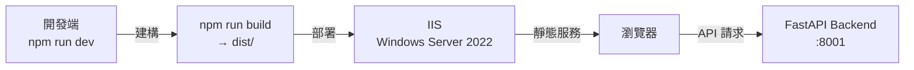
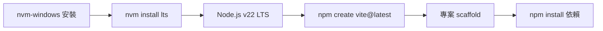
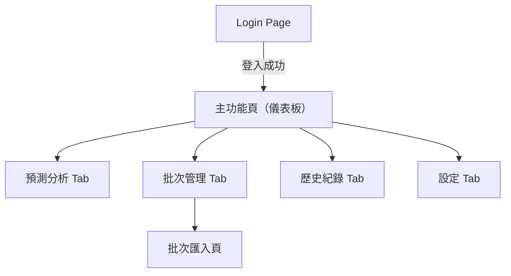
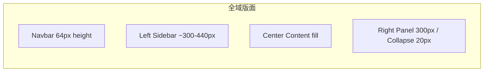
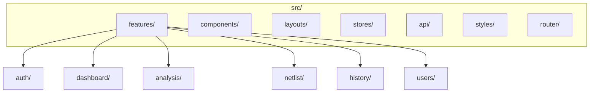

# ACT Failure Analysis System Frontend — 工作報告

> **專案名稱**：ACT Data Analysis System Frontend
> **報告期間**：2026-05-25 ~ 2026-05-29（W22）
> **負責人**：Dante

---

## 任務內容

本週為前端專案的**啟動週**，主要任務為專案環境初始化與技術選型討論。

### 本週主要工作項目

1. 閱讀並整理後端 API Contract（`api-contract-structure.instructions.md`）
2. 閱讀 UI/UX 設計說明文件（`ui-ux-design.instructions.md`）
3. 初始化 Git 版本控制（master / Dante 分支）
4. 建立專案文件（`to-do-list.md`、`README.md`、`docs/reports/`）
5. 前端技術選型討論與確認

---

## 技術說明

### 確認技術選型

| 類別 | 選擇 | 說明 |
|------|------|------|
| 框架 | React 18 + TypeScript | 開發者已有經驗，生態系最大 |
| 建構工具 | Vite | 快速 HMR，React 官方推薦 |
| 狀態管理 | Zustand | 輕量，適合此專案規模 |
| UI Library | Ant Design 5.x | 企業級，暗色主題完整，Table/Form 豐富 |
| 圖示 | lucide-react | 設計稿指定 Lucide Icon 系列 |
| HTTP Client | Axios + Interceptor | JWT Bearer Token + 統一錯誤處理 |
| 傳統圖表 | ECharts（echarts-for-react）| 折線 / 柱狀 / 熱圖 |
| 疊層 Die 圖 | Cytoscape.js | 節點層次關係視覺化 |
| 路由 | React Router v6 | SPA 路由 + 路由守衛 |

### 部署架構（Windows Server 2022）

### 環境安裝順序

### IIS 部署設定

- 啟用 IIS（Windows 功能）
- 安裝 URL Rewrite Module（SPA 路由 fallback）
- `dist/` 複製至 IIS 網站根目錄
- 加入 `web.config` 處理 React Router fallback to `index.html`

### 全域版面骨架

### 前端模組規劃（初步）

### API 串接概覽

| 模組 | API 端點 | 說明 |
|------|----------|------|
| 認證 | `POST /api/v1/auth/login` | LDAP 登入，取得 JWT |
| 認證 | `GET /api/v1/auth/me` | 取得當前使用者資訊 |
| 資料查詢 | `GET /api/v1/data/search` | 查詢 Lot + HBIN 的 Fail 資料 |
| Netlist | `POST /api/v1/netlist/upload` | 上傳 Netlist Excel |
| Netlist | `GET /api/v1/netlist/programs` | 列出已上傳 Programs |
| 分析 | `GET /api/v1/analysis/fail-sample` | Fail Sample List 分析 |

---

## 成果總覽

| 檔案 / 目錄 | 說明 |
|-------------|------|
| `.gitignore` | Git 忽略規則 |
| `README.md` | 專案說明文件（初版） |
| `to-do-list.md` | 專案待辦事項清單（初版） |
| `docs/reports/20260529_W22.md` | 本週工作報告 |
| `Git: master` | 初始 commit |
| `Git: Dante` | 開發分支 |

---

## 後續行動

| 項目 | 說明 |
|------|------|
| 技術選型確認 | 與 Dante 確認框架（Vue 3 / React）、UI Library、狀態管理等 |
| 專案 scaffold | 依技術選型使用 Vite 初始化專案 |
| 設計系統建立 | 依 UI/UX 文件建立色彩、字型、元件 token |
| 路由與版面 | 建立 Navbar、Sidebar、全域 Layout 骨架 |
| 登入頁實作 | Login Page + JWT 認證流程 |
