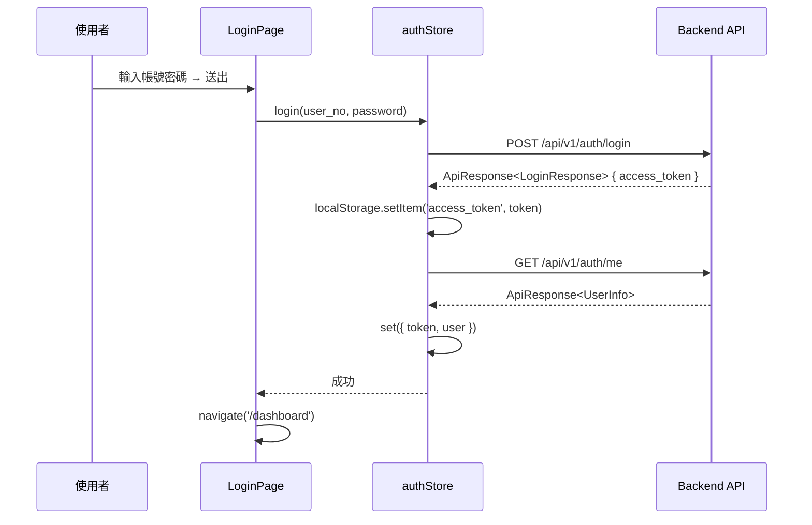

# ACT Failure Analysis System Frontend — 工作報告

> **專案名稱**：ACT Data Analysis System Frontend
> **報告期間**：2026-06-01 ~ 2026-06-06（W23）
> **負責人**：Dante

---

## 任務內容

本週完成 **Auth 基礎設施**，包含 Axios client、Zustand auth store、React Router 路由守衛、MainLayout 版面骨架、LoginPage 介面，並修正測試過程中發現的三個錯誤。

### 本週主要工作項目

1. Axios client 實作（JWT Bearer interceptor + 統一錯誤處理 + logger 整合）
2. Zustand auth store（login / logout / restoreSession）
3. React Router v7 設定 + 路由守衛（PrivateRoute）
4. MainLayout 版面骨架（Navbar 64px + Sider 320px + Content）
5. LoginPage 介面實作（Activity logo + icon prefix + 無紅色星號）
6. 修正 422 錯誤（LoginRequest 欄位名稱錯誤）
7. 修正 401 錯誤（ApiResponse 型別與 token 取值錯誤）
8. 登入效能問題診斷（確認為公司網路問題，程式碼無誤）

---

## 技術說明

### Auth 流程



### 修正的三個問題

| 問題 | 原因 | 修正 |
|------|------|------|
| **422 Unprocessable Content** | `LoginRequest` 欄位名稱為 `employee_id`，後端要求 `user_no` | 修正型別定義與 authStore 呼叫 |
| **401 Unauthorized（getMe）** | `apiClient.post<LoginResponse>` 導致 `data.access_token` 取到 `undefined`，以 `Bearer undefined` 呼叫 getMe | 改用 `ApiResponse<LoginResponse>` 型別，取值改為 `data.data!.access_token` |
| **LoginPage UI** | 紅色必填星號（UX 不適合）、Input 無 icon 前綴 | `requiredMark={false}`、加入 user.png / lock.png prefix |

### API 回應包裝格式

```typescript
// 後端所有 API 回應均包裝在 ApiResponse<T>
interface ApiResponse<T> {
  code: number;
  message: string;
  data: T;
}

// 正確的取值方式
const { data: loginResp } = await apiClient.post<ApiResponse<LoginResponse>>('/auth/login', ...);
const token = loginResp.data!.access_token;  // response.data.data.access_token
```

### 登入效能診斷

| 量測工具 | POST /auth/login | GET /auth/me |
|----------|-----------------|--------------|
| Browser DevTools Network | 305 ms | 61 ms |
| DB audit_log | 58 ms | 6 ms |

**結論**：程式碼沒有效能問題，先前 21 秒為公司網路瞬間問題，非程式碼 bug。

### 路由架構

```mermaid
graph LR
    A[/] --> B{有 token?}
    B -->|否| C[/login → LoginPage]
    B -->|是| D[/dashboard → DashboardPage]
    C -->|登入成功| D
    D -->|登出| C
```

---

## 成果總覽

| 檔案 | 說明 |
|------|------|
| `src/api/client.ts` | Axios instance，JWT Bearer interceptor，401/403/5xx 統一處理 |
| `src/api/auth.ts` | `login()` / `getMe()` API 函式（ApiResponse 型別正確） |
| `src/stores/authStore.ts` | Zustand auth store（login / logout / restoreSession + persist） |
| `src/router/index.tsx` | createBrowserRouter（/login, /dashboard） |
| `src/router/PrivateRoute.tsx` | 路由守衛（無 token → redirect /login） |
| `src/layouts/MainLayout.tsx` | Navbar(64px) + Sider(320px) + Content 骨架 |
| `src/features/auth/LoginPage.tsx` | 登入頁（Activity logo、icon prefix、無紅色星號） |
| `src/features/dashboard/DashboardPage.tsx` | 儀表板佔位頁面 |
| `public/user.png` | 帳號輸入框前綴圖示 |
| `public/lock.png` | 密碼輸入框前綴圖示 |
| `Git: Dante-feat-auth-infra` | 本週功能 commit（2 commits） |

---

## 後續行動

| # | 項目 | 說明 |
|---|------|------|
| 21 | 建立測試環境 | 安裝 Vitest + @testing-library/react，撰寫 auth 模組單元測試 |
| 22 | Logger 單元測試 | 撰寫 Logger 模組單元測試 |
| — | Merge auth branch | `Dante-feat-auth-infra` → `Dante` |
| 6 | 主儀表板頁 | LOT 搜尋、Fail Mode 篩選 |
| 7 | Fail Sample List | 表格元件 |
| 8 | Fail Sample on Tray | Tray 網格圖表 |

---
