# ACT Failure Analysis System — 網頁開發報告

> 報告日期：2026-06-11
> 撰寫者：Dante
> 版本：v1.0（第一階段 Release）
>
> **補充說明（2026-07-08）**：第三章原僅涵蓋 v1.0 上線時已完成的功能（認證、Dashboard 搜尋快取、Fail Sample List、ResultsPanel、Logging）。第二階段（2026-06-25～06-30）完成的四張圖表——**Top 1 Fail Die**、**Fail Die Rate**、**Fail Ball**、**Fail Sample on Tray**——當時尚未開發，故未收錄。本次依實際程式碼（`src/features/dashboard/components/`、`src/features/dashboard/utils/analysisHelpers.ts`）補上完整資料處理邏輯說明（3.4～3.7 節），並將原 3.4／3.5 節依序調整為 3.8／3.9 節，其餘章節內容不變。第二階段功能的整體進度與規劃內容另見 `docs/reports/20260708_ACT-Frontend-Report.md`。

---

## 目錄

1. [需求與 UI/UX 設計發想說明](#一需求與-uiux-設計發想說明)
2. [系統架構與設計發想說明](#二系統架構與設計發想說明)
3. [網頁功能與資料處理邏輯說明](#三網頁功能與資料處理邏輯說明)
4. [測試說明](#四測試說明)
5. [網頁部署](#五網頁部署)
6. [第二階段規劃與未來展望](#六第二階段規劃與未來展望)

---

## 一、需求與 UI/UX 設計發想說明

### 1.1 系統背景

本系統為 **ACT Failure Analysis System**，是一套針對封裝廠 ACT 測試資料所建立的智慧分析平台。

| 項目 | 說明 |
|------|------|
| **使用單位** | ASE 5920 測試工程師（RD、PE、EE）及管理員 |
| **核心痛點** | 產線工程師需要手動查詢 MongoDB 中的 ACT 測試資料，分析 Fail Sample 位置與 Die 關聯，過程繁瑣且耗時 |
| **解決方案** | 提供圖形化介面，輸入 Lot ID 即可快速查看 Fail Sample List、Fail Die 分布、Fail Ball 等分析結果 |

### 1.2 使用者角色與權限

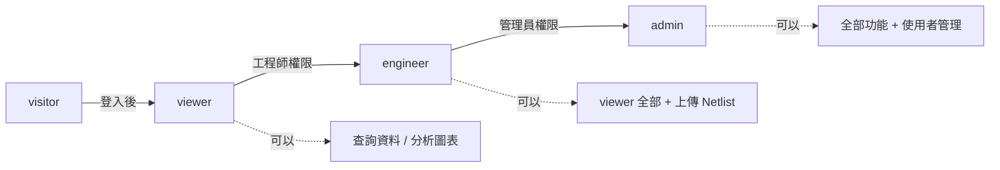

### 1.3 第一階段功能需求

> **狀態更新（2026-07-08）**：以下「第二階段」功能已於 2026-06-25～06-30 全數完成上線（Netlist 管理僅完成子表查詢 API，上傳頁面仍規劃中），資料處理邏輯詳見第三章 3.4～3.7 節。

| 功能 | 狀態 | 說明 |
|------|------|------|
| LDAP 帳密登入 | ✅ 完成 | 工號 + 密碼，區分 LDAP 服務異常 / 帳密錯誤 |
| LOT 搜尋 | ✅ 完成 | 輸入 Lot ID，選擇 Fail Mode（HBIN）查詢 |
| Fail Sample List 表格 | ✅ 完成 | 顯示 DUT No / Die No / Ball Name，分頁顯示，支援 IO/POWER 雙模式 |
| 結果分析文字 | ✅ 完成 | IO pin fail 統計、最高頻 Die/Ball 自動推算 |
| 搜尋歷史記錄 | ✅ 完成 | 顯示近期查詢的 Lot ID |
| 響應式版面 | ✅ 完成 | 支援 Mobile / Tablet / Laptop / Desktop |
| Fail Sample on Tray | ✅ 完成（第二階段） | Tray 佈局圖，見 3.7 節 |
| Fail Die / Fail Die Rate | ✅ 完成（第二階段） | 疊 Die 結構圖，見 3.4／3.5 節 |
| Fail Ball 圖 | ✅ 完成（第二階段） | BGA Ball 分佈圖，見 3.6 節 |
| 暗／淺色主題切換 | ✅ 完成（第二階段，原規劃外新增） | 見 `docs/reports/20260708_ACT-Frontend-Report.md` 第三章 |
| Netlist 管理 | 🔄 部分完成 | 子表查詢 API（stacking-die／tray）已完成並供上述圖表使用；上傳／瀏覽頁面仍規劃中，見第六章 |

### 1.4 UI/UX 設計原則

**設計目標：**
- **資訊密度**：單一畫面呈現多維分析結果，減少頁面切換
- **工程師友善**：簡潔功能導向 UI，避免裝飾性元素
- **長時間使用**：暗色主題降低視覺疲勞
- **可延伸性**：元件化設計，方便後續擴充功能

### 1.5 設計系統（Design System）

#### 色彩架構——深海藍暗色系（Deep Navy Dark Theme）

```
色彩層次（由深到淺）
──────────────────────────────────────
#0a1929  主背景->  頁面底層
  └── #0d1e30  側欄背景->  左側導覽欄
        └── #112240  卡片背景->  圖表框、卡片
              └── #1e3a5f  邊線/分隔->  卡片描邊
──────────────────────────────────────
功能色
  主要藍     #1e88e5  按鈕、Logo、互動重點元素
  亮藍       #42a5f5  Active 狀態、強調文字
  柔藍       #90caf9  Secondary 文字、標籤
  成功綠     rgb(18, 53, 19)  正常 Badge
  警告紅     #ff5252  Fail Badge
  Dut No    #054114  DUT No 編號
  Die No    #2914eb  Die No 編號
  Bin Name  #f5be0c  Bin Name 名稱
```

**設計理由**：工廠工程環境習慣深色 UI（示波器、ERP、MES），暗色背景讓圖表高亮色（紅/黃/綠）更突出。

#### 字型系統

| 層級 | 字號 | 用途 |
|------|------|------|
| Section Title | 18px / 700 | 儀表板標題、面板標題 |
| Card Title | 15–16px / 700 | 卡片主標 |
| Content Title | 13–14px / 600 | 圖表標題 |
| Body | 12–13px / 400–500 | 一般內容 |
| Caption | 10–11px / 400–600 | Badge、輔助說明 |

### 1.6 版面架構設計

#### 整體佈局

```
┌────────────────────────────────────────────────────┐
│  Navbar（60px）── 品牌標題 + 使用者帳號               │
├────────────────┬───────────────────────────────────┤
│  Left Sidebar  │  DashboardHeader（Fail Mode 選擇） │
│  （280px）      ├────────────────────────────────────┤
│                │  ResultsPanel（140px，分析文字）    │
│  ・LOT 搜尋     ├──────────────┬─────────────────────┤
│  ・Fail Mode   │              │  圖表 2×2 Grid      │
│  ・搜尋歷史     │  Fail Sample │  ┌──────┬──────┐    │
│                │  List       │  │Tray  │ Die │   │
│                │  （25% 寬）  │  ├──────┼──────┤   │
│                │              │  │DRate │ Ball │   │
│                │              │  └──────┴──────┘   │
└────────────────┴──────────────┴─────────────────────┘
```

#### 設計決策重點

1. **左側欄搜尋 + 歷史**：靈感來自醫療影像軟體的 Patient Browser 概念，讓工程師不離開主畫面即可切換批次
2. **Fail Mode 頂部浮層**：下拉選單以絕對定位覆蓋在圖表上方，不壓縮圖表空間
3. **1:4 欄位比例**：Fail Sample List 佔 25%，圖表群佔 75%，資料表格與視覺圖表並排
4. **響應式斷點**：Mobile < 768px、Tablet < 1024px、Laptop < 1440px、Desktop ≥ 1440px

---

## 二、系統架構與設計發想說明

### 2.1 整體架構

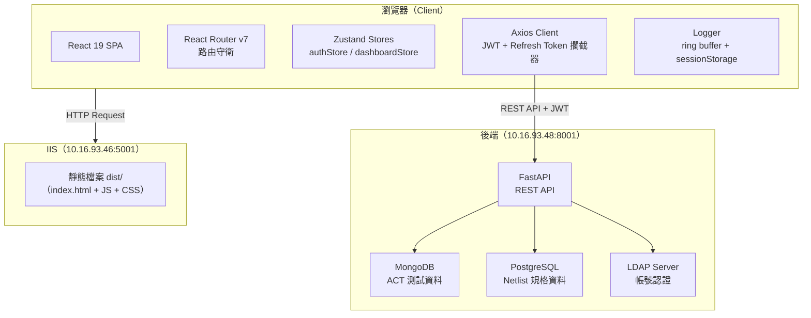

### 2.2 技術選型

| 類別 | 技術 | 版本 | 選型理由 |
|------|------|------|---------|
| 框架 | React | 19.2.6 | 開發者有經驗、生態最大、與 Cytoscape.js 相容 |
| 語言 | TypeScript | 6.0.2 | 強型別、錯誤提前發現、IDE 自動補全 |
| 建構工具 | Vite | 8.0.14 | 快速 HMR、React 官方推薦 |
| 狀態管理 | Zustand | 5.0.14 | 輕量無 boilerplate、支援 persist middleware |
| UI Library | Ant Design | 6.4.3 | 企業級元件、暗色主題、Table/Form 完整 |
| HTTP Client | Axios | latest | 攔截器機制、JWT 統一注入、型別泛型 |
| 圖表 | ECharts | 6.1.0 | 折線/柱狀/熱圖（統計圖表） |
| 圖形 | Cytoscape.js | 3.33.4 | 節點關係視覺化（Fail Die 疊層圖） |
| 測試 | Vitest | 4.x | Vite 原生整合、Jest 相容 API |

#### 選型決策摘要

**React vs Svelte vs Vue：** 選 React，因開發者有實際經驗、配套生態（Router/State/UI/Testing）最完整。

**Zustand vs Redux：** 選 Zustand，本系統狀態結構相對單純，不需 Redux 的複雜 middleware；支援 `persist` middleware 讓 auth token 直接持久化至 localStorage。

**IIS vs Nginx vs Apache：** 選 IIS，因目標部署環境為 Windows Server 2022，IIS 為系統內建，搭配 URL Rewrite Module 可處理 SPA 路由。

### 2.3 前端目錄結構

```
src/
├── api/              # Axios instance + API 呼叫函式
│   ├── client.ts     # JWT Bearer + Rolling Refresh Token 攔截器
│   ├── auth.ts       # 認證相關 API
│   ├── analysis.ts   # 分析相關 API（fail-sample／fail-sample-power）
│   ├── netlist.ts    # ⭐ Netlist 相關 API（stacking-die／tray）
│   └── data.ts       # 資料查詢 API
├── features/         # 功能模組（Feature-based 架構）
│   ├── auth/
│   │   └── LoginPage.tsx
│   └── dashboard/
│       ├── DashboardPage.tsx
│       ├── components/
│       │   ├── FailSampleList.tsx      # 3.3 節
│       │   ├── FailDieChart.tsx        # ⭐ 3.4 節（第二階段新增）
│       │   ├── FailDieRateChart.tsx    # ⭐ 3.5 節（第二階段新增）
│       │   ├── FailBallChart.tsx       # ⭐ 3.6 節（第二階段新增）
│       │   ├── FailTrayChart.tsx       # ⭐ 3.7 節（第二階段新增）
│       │   ├── ResultsPanel.tsx        # 3.8 節
│       │   └── SearchPanel.tsx／SearchHistory.tsx／DashboardHeader.tsx
│       ├── utils/
│       │   └── analysisHelpers.ts      # 純函式（ResultsPanel／FailBall／FailTray 共用）
│       └── ...
├── layouts/
│   └── MainLayout.tsx      # Navbar + Content Outlet
├── router/
│   ├── index.tsx           # 路由定義
│   └── PrivateRoute.tsx    # 路由守衛
├── stores/
│   ├── authStore.ts        # 登入狀態管理
│   ├── dashboardStore.ts   # 搜尋/快取狀態管理（IO＋POWER＋Tray 規格，見 3.2 節）
│   └── themeStore.ts       # ⭐ 主題（dark/light）狀態管理（第二階段新增，persist）
├── styles/
│   ├── tokens.ts           # 設計系統 Token（色彩/字型/響應式）
│   ├── antdTheme.ts        # Ant Design 暗色主題
│   └── index.css           # 全域 CSS
├── types/
│   └── api.ts              # TypeScript 型別定義
├── hooks/
│   ├── useResponsiveTokens.ts   # 響應式 Token hook
│   └── useThemeColors.ts        # ⭐ dark/light 主題色彩 hook（第二階段新增）
└── utils/
    └── logging/            # 前端 Logger 模組
```

### 2.4 狀態管理設計

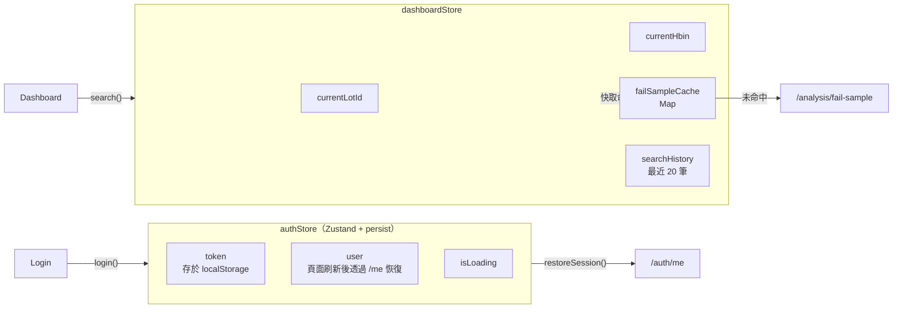

**快取策略：** 相同 `lotId + hbin` 的查詢結果快取於記憶體，頁面刷新前不重複呼叫 API。

### 2.5 JWT + Rolling Refresh Token 機制

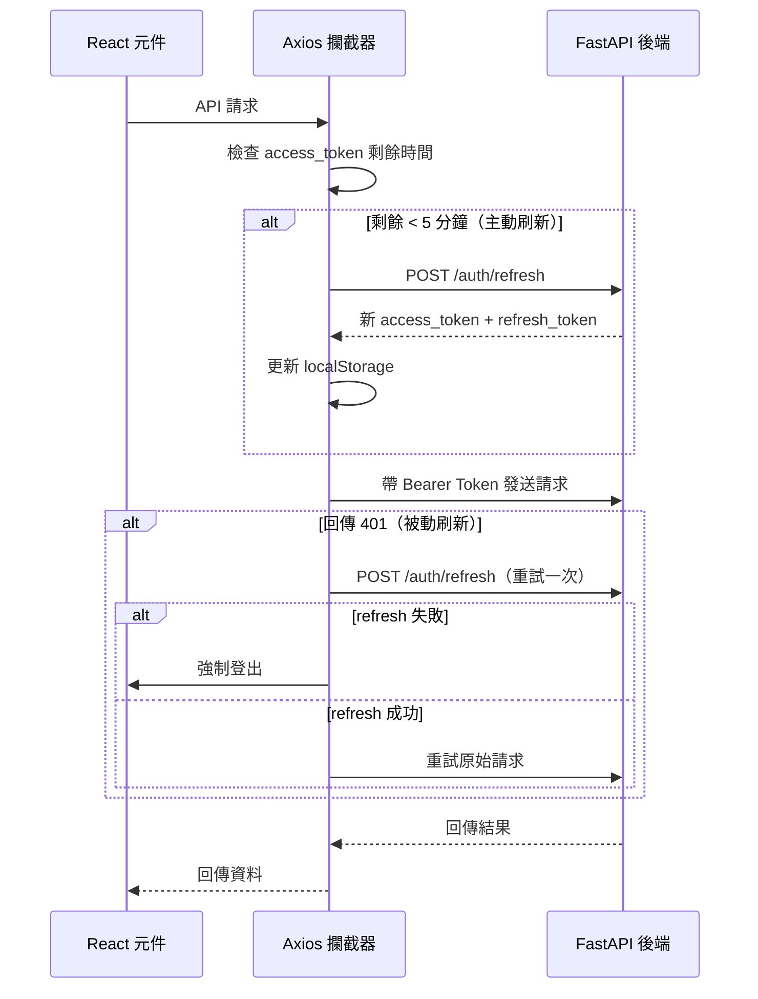

**並發保護：** 多個 API 請求同時觸發 401 時，只發送一次 refresh 請求，其餘請求排隊等待結果。

### 2.6 響應式設計架構

```
斷點定義（tokens.ts）
─────────────────────────────────────────────────
Mobile   < 768px   : sidebarWidth:220, tableScrollY:260
Tablet   < 1024px  : sidebarWidth:260, tableScrollY:300
Laptop   < 1440px  : sidebarWidth:280, tableScrollY:360
Desktop  ≥ 1440px  : sidebarWidth:300, tableScrollY:520
─────────────────────────────────────────────────
```

`useResponsiveTokens()` hook 監聽 `window.resize`，根據視窗寬度動態回傳對應的 token 值（字型大小、間距、元件尺寸）。

---

## 三、網頁功能與資料處理邏輯說明

### 3.1 認證流程

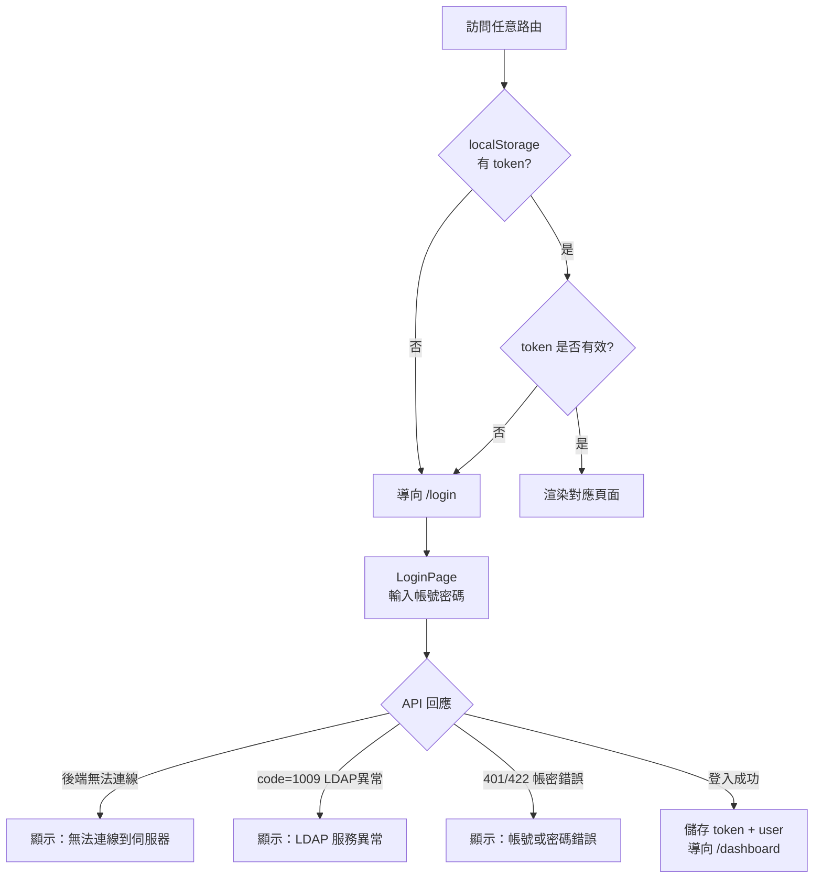

**頁面刷新後的 user 恢復：** `persist` 只保存 token，user 資訊不持久化。`MainLayout` 在 mount 時若偵測到 `token 存在但 user 為 null`，自動呼叫 `GET /auth/me` 恢復使用者資訊。

### 3.2 Dashboard 搜尋與快取流程

> **補充（2026-07-08）**：第二階段新增 POWER 分析與 Fail Sample on Tray 後，`dashboardStore` 的搜尋邏輯已擴充為「IO + POWER 雙資料源並行查詢」與「Tray 規格獨立懶加載快取」，下圖為目前實際流程。

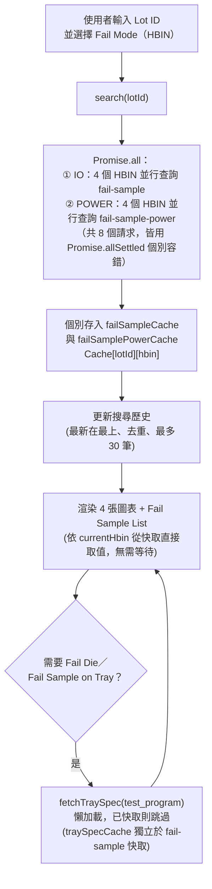

**預設行為：** 搜尋時 Fail Mode 預設為 **Short（HBIN=3）**；切換 Lot ID 時一次性並行取得該 Lot 全部 4 個 HBIN 的 IO 與 POWER 資料並快取，確保使用者切換 Fail Mode 或 IO/POWER 模式時無等待時間。Tray 規格（`col_count`／`row_count`）因固定不隨 HBIN 改變，故獨立以 `test_program` 為 key 快取，避免重複請求。

**404 容錯：** 個別 HBIN 查無資料時該筆快取存為 `null`（非拋錯中斷整體搜尋），Fail Sample List／各圖表依各自邏輯顯示對應的空值提示文字（見 3.3～3.7 節）。

### 3.3 Fail Sample List 資料處理

**資料展開邏輯：** 後端回傳的 `fail_sample` 為 DUT 維度（一個 DUT 對應多個 ball_name），前端展平為「一列對應一個 Ball」：

```
後端資料（DUT 維度）        前端表格（Ball 維度）
─────────────────────        ────────────────────────────
dut_no: 3                →   DutNo=3 / DieNo=U1 / Ball=F15_H9
ball_name: [F15_H9, AY10]→   DutNo=3 / DieNo=U1 / Ball=AY10
die_no: [U1, U1]
```

**空 Ball 處理：** 若 `ball_name` 為空陣列（表示 Fail DUT 但無 IO pin fail），仍保留一列以「`—`」顯示，讓工程師能看到 DUT 的存在，而非誤以為該 DUT 沒有被查到。

**rowSpan 分頁重算：** 同一 DUT 展開的多列會合併 `Dut No` 儲存格（rowSpan）。由於分頁（每頁 20 筆）會切斷同一 DUT 的連續列，rowSpan **必須在「目前分頁的 slice 內」重新計算**（`calcRowSpan()`），而非對全部資料一次算好，否則會發生「同一 DUT 被拆到兩頁、儲存格合併錯位」的問題。

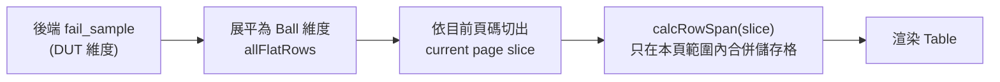

**IO / POWER 雙模式：** 同一元件透過 `variant` prop（`'io' | 'power'`）切換資料來源（`getCurrentFailSample()` 或 `getCurrentFailSamplePower()`），Dashboard 上以兩個獨立 Table 並排呈現，欄位與展開邏輯完全共用。

**空值狀態區分：** 依目前查詢狀態顯示不同提示文字，避免工程師誤判：

| 情境 | 顯示文字 |
|------|---------|
| 尚未輸入 Lot ID | 請先搜尋 Lot ID |
| 未選擇 Fail Mode | 請選擇 Fail Mode |
| POWER 模式尚未查詢過（新查詢但快取還沒回來） | 請重新搜尋以取得 POWER 資料 |
| 該 Fail Mode 查無資料 | 此 Fail Mode 無 Fail 資料 |
| Lot 尚未上傳 Netlist | 此 Lot 尚未上傳 Netlist |

**固定高度設計：** 透過 CSS override (`.ant-table-body { height: Npx !important }`) 強制 Table body 固定高度，避免資料少時版面縮小；捲軸樣式並依 dark/light 主題切換顏色。

---

### 3.4 Top 1 Fail Die（疊層圖）資料處理邏輯

**元件**：`FailDieChart.tsx`　**資料來源**：`GET /netlist/programs/{test_program}/stacking-die`（回傳 `layer_no`／`unity_no`／`is_substrate` 疊層結構）＋ 目前查詢的 `fail_sample` 結果。

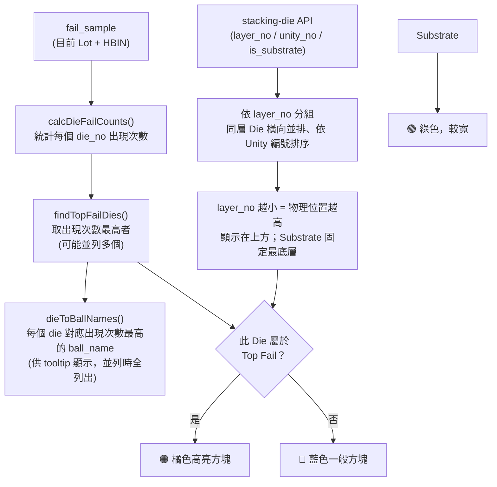

**版面細節**：容器寬度以 `ResizeObserver` 動態量測，同一層有多個 Die 時平均分配寬度；相鄰層級的方塊以左右交錯偏移（奇數層向左、偶數層向右）呈現視覺上的立體堆疊層次感。方塊 hover 時的 Tooltip 顯示「失效次數」與「集中的 Ball Name」。

> **與 ResultsPanel／Fail Sample on Tray 的關係**：本圖表的「Top Fail Die」統計為獨立實作（`calcDieFailCounts`／`findTopFailDies`，皆定義於 `FailDieChart.tsx` 內），與 3.7 節、3.8 節共用的 `computeAnalysis()`（定義於 `analysisHelpers.ts`）為**個別實作但邏輯等價**（皆為「die_no 出現頻率最高者，平局全列」），實務結果一致。

---

### 3.5 Fail Die Rate 資料處理邏輯

**元件**：`FailDieRateChart.tsx`　**資料來源**：與 3.4 節相同的 `stacking-die` API（取得全部 Unity 清單，排除 Substrate 並依編號排序）。

**Fail Rate 計算方式**：

```
分子：每個 DUT 的 die_no 先去重（同一 DUT 內同一 Die 只算一次），
      再統計該 Die 出現在幾個不同 DUT 中
分母：total_qty（此 Lot 在該 Fail Mode 下的實際失效 DUT 總數）

Fail Rate（%） = 分子 ÷ total_qty × 100
```

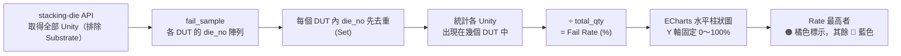

**設計重點**：Y 軸固定為 0～100% 區間（不隨資料浮動），讓工程師能直接判斷失效率的相對嚴重程度；X 軸資料量較多時自動縮小字級並限制長條最大寬度，避免版面壓縮。

---

### 3.6 Fail Ball 資料處理邏輯

**元件**：`FailBallChart.tsx`　**核心函式**：`calcTopBalls()`（`analysisHelpers.ts`，與 ResultsPanel 共用）。

**計算邏輯**：統計 `ball_name` 在所有 DUT 中出現的**總次數**（同一 DUT 內重複出現的 ball 也累加計入），依次數降冪排序後取**前 10 名**繪製水平柱狀圖。

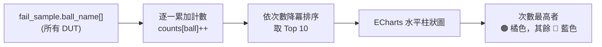

**IO / POWER 切換**：右上角 `Segmented` 切換鈕，切換資料來源（`getCurrentFailSample()` ↔ `getCurrentFailSamplePower()`），計算邏輯完全共用，僅輸入資料不同；POWER 模式若尚未查詢過會與 Fail Sample List（3.3 節）顯示相同的提示文字區分邏輯。

**Y 軸上限**：取「該 Lot 的 `total_duts`」與「Top 1 Ball 次數」兩者中的較大值，確保長條圖有穩定的比例基準，不會因為資料量小而使圖表比例失真。

---

### 3.7 Fail Sample on Tray 資料處理邏輯

**元件**：`FailTrayChart.tsx`　**核心函式**：`computeAnalysis()` ＋ `buildTrayPages()`（皆定義於 `analysisHelpers.ts`，與 ResultsPanel 共用同一份 `computeAnalysis()`）。**資料來源**：`GET /netlist/programs/{test_program}/tray`（回傳 `col_count` × `row_count`）＋ 目前的 `fail_sample` 結果。

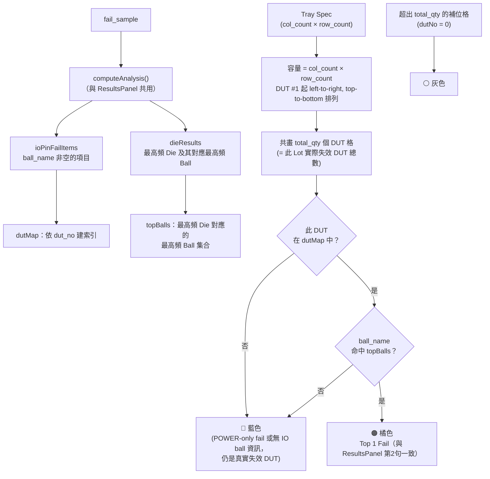

**分頁邏輯**：每頁容量 = `col_count × row_count`，`total_qty` 較大時自動分頁（頁碼導航於卡片底部），最後一頁不足容量以灰色佔位格補滿，維持格子外觀方正。

**IO / POWER 切換**：與 Fail Ball（3.6 節）相同的 `Segmented` 切換設計，兩種模式共用同一套著色與分頁邏輯。

---

### 3.8 ResultsPanel 分析文字邏輯

分析文字格式：

```
1. {total_qty}ea {FailMode} sample 中有 {io_fail_count}ea 為 IO pin fail.
2. {io_fail_count}ea 的 {FailMode} sample 均集中在 {Die(Ball)}.
```

**資料計算邏輯：**

| 變數 | 計算方式 |
|------|---------|
| `total_qty` | API 回傳 `total_qty`（MongoDB 查得的 Fail DUT 總數） |
| `io_fail_count` | 統計 `fail_sample` 中 `ball_name` 不為空的 item 數量 |
| 最高頻 Die | 統計所有 `die_no` 出現次數，取最高者（平局全列） |
| 最高頻 Ball | 在同一 Die 的資料中，統計 `ball_name` 出現次數，取最高者（平局全列） |

**邊界條件：**
- `total_qty = 0` → 顯示「無對應資料」
- `io_fail_count = 0` → 只顯示第 1 句，不顯示第 2 句
- Die 或 Ball 出現次數平局 → 全部列出（例：U2(AU18) / U7(AY10)）

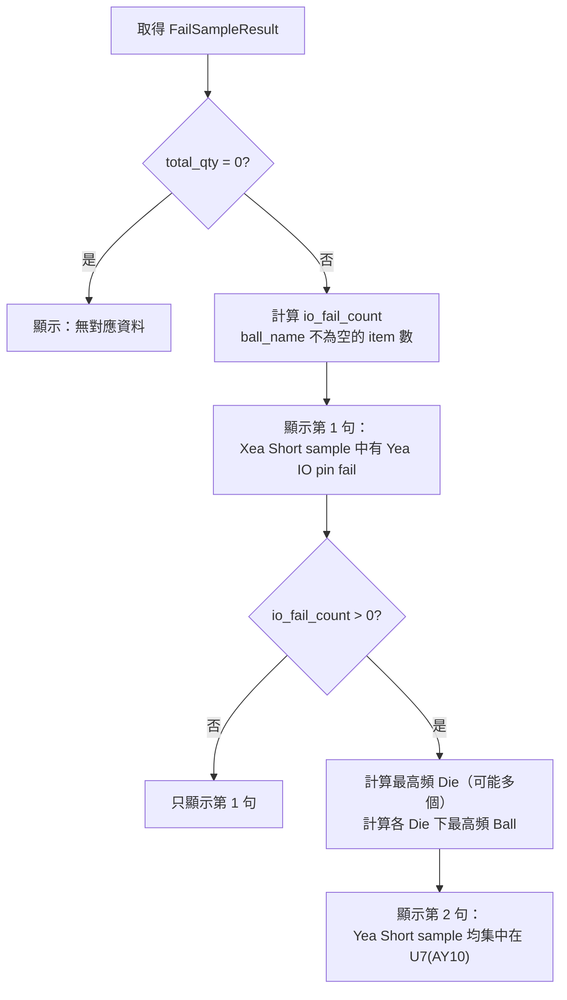

### 3.9 前端 Logging 機制

```
Logger 架構
──────────────────────────────────────────
addLog({ level, module, stack, msg })
         │
         ├──▶ Ring Buffer（2000 筆上限）
         │      └──▶ sessionStorage（頁面刷新後仍保留）
         │
         ├──▶ console 輸出（彩色 CSS 樣式）
         │
         └──▶ downloadLogs()（下載 .log 檔）
──────────────────────────────────────────
整合點：
  Axios Request Interceptor → 記錄所有 API 請求
  Axios Response Interceptor → 記錄 API 回應及錯誤
  Login 失敗 → 記錄 apiCode 與 user_no
```

---

## 四、測試說明

### 4.1 測試架構

| 項目 | 技術 | 說明 |
|------|------|------|
| 測試框架 | Vitest 4.x | Vite 原生整合，速度快 |
| DOM 環境 | jsdom | 模擬瀏覽器 DOM 環境 |
| 元件測試 | @testing-library/react | 以使用者視角測試元件行為 |
| 斷言工具 | @testing-library/jest-dom | 語意化 DOM 斷言 |
| 行為模擬 | @testing-library/user-event | 模擬滑鼠、鍵盤操作 |

### 4.2 測試目錄結構

> **數量更新（2026-07-08 實測校正）**：v1.0 撰寫時記載的各檔案測試數與加總（57）本身即有出入，以下已依 `npx vitest run` 實際執行結果校正。`analysisHelpers.test.ts` 因第二階段新增 `calcTopBalls()`／`buildTrayPages()`（供 Fail Ball／Fail Sample on Tray 使用，見 3.6／3.7 節）測試量成長最多。

```
tests/
├── setup.ts               # 全域 setup
│                          #  ・jest-dom 自動引入
│                          #  ・matchMedia mock（Ant Design Grid 相容性）
│                          #  ・localStorage mock
├── unit/                  # 純邏輯單元測試（不需 DOM）
│   ├── logging.test.ts    # Logger 模組（10 tests）
│   ├── authStore.test.ts  # 認證 Store 邏輯（7 tests）
│   ├── dashboardStore.test.ts  # Dashboard Store + 快取（15 tests）
│   └── analysisHelpers.test.ts # 分析文字/圖表計算邏輯（24 tests）
└── components/            # React 元件測試（含 UI 互動）
    └── LoginPage.test.tsx # 登入頁元件（10 tests）
```

### 4.3 測試覆蓋項目

**目前測試數量：66 tests（5 個測試檔案，全部通過 ✅，2026-07-08 實測）**

#### logging.test.ts（10 tests）
- Ring buffer 上限機制（超過 2000 筆時自動覆蓋最舊的）
- sessionStorage 持久化
- `downloadLogs()` 觸發 Blob 下載
- `clearLogs()` 清除功能

#### authStore.test.ts（7 tests）
- 初始狀態驗證
- 登入成功後 token / user / isLoading 狀態更新
- 登出後清除 token + localStorage
- `restoreSession()` 呼叫 `/auth/me` 恢復使用者資訊

#### dashboardStore.test.ts（15 tests）
- 搜尋觸發 API 呼叫（`isSearching` 狀態）
- 同一 lot+hbin 第二次搜尋直接命中快取（不重複呼叫 API）
- `setHbin()` 切換 Fail Mode
- 搜尋歷史紀錄（最多 30 筆，重複的 lot 移至最上方）
- 搜尋歷史不重複新增

#### analysisHelpers.test.ts（24 tests）
- `countFrequency()` 頻率統計、`getTopKeys()` 取最高頻項目（含平局處理）
- `computeAnalysis()` 完整分析文字計算（total_qty=0 無資料／io_fail_count=0 只顯示第1句／Die 或 Ball 平局全列出）
- ⭐ `calcTopBalls()`：Top N Ball 排序計算（Fail Ball 圖表，3.6 節）
- ⭐ `buildTrayPages()`／`getCellStatus()`：Tray 分頁與橘/藍/灰著色邏輯（Fail Sample on Tray，3.7 節）

#### LoginPage.test.tsx（10 tests）
- 渲染標題與品牌元素
- 表單驗證（空帳號/空密碼）
- 登入成功後 navigate 到 `/dashboard`
- 後端無回應 → 顯示「無法連線」
- LDAP 服務異常（code=1009）→ 顯示「LDAP 服務異常」
- 帳密錯誤（401）→ 顯示「帳號或密碼錯誤」

> **已知缺口**：`FailDieChart`／`FailDieRateChart` 兩個元件目前尚無專屬單元測試（僅透過手動驗證與 build 檢查確認正確性），建議列入後續補強項目。

### 4.4 執行測試

```powershell
# 執行全部測試
& "C:\nvm4w\nodejs\node.exe" ".\node_modules\vitest\vitest.mjs" run

# 監聽模式（開發時即時反饋）
& "C:\nvm4w\nodejs\node.exe" ".\node_modules\vitest\vitest.mjs"
```

---

## 五、網頁部署

### 5.1 環境架構

```
┌──────────────────────────────────────────────────────┐
│   Build 機（10.16.93.48）                            │
│   ・Node.js v22.13.1 LTS（nvm-windows）              │
│   ・前端原始碼：D:\ACT\Failure Analysis System\      │
│   ・後端 FastAPI：port 8001                          │
└──────────────────────────┬───────────────────────────┘
                           │ npm run build
                           │ → 產出 dist/（約 1.1MB）
                           │ 複製 dist/ 到 IIS 機
                           ▼
┌──────────────────────────────────────────────────────┐
│   IIS 機（10.16.93.46:5001）                         │
│   ・IIS 10（Windows Server 2022 內建）               │
│   ・URL Rewrite 2.1 模組                             │
│   ・Physical Path → C:\inetpub\ACT-Frontend\（dist/）│
└──────────────────────────────────────────────────────┘
```

### 5.2 環境變數設定

```
.env/                  # 整個資料夾已 gitignore
├── .env               # 正式環境設定（build 時載入）
│     VITE_API_BASE_URL=http://10.16.93.48:8001
└── .env.dev           # 開發環境覆蓋（npm run dev 時載入）
      VITE_API_BASE_URL=      ← 空字串，使用 Vite proxy
      DEV_API_TARGET=http://localhost:8002
```

**關鍵機制：** `VITE_API_BASE_URL` 在 `npm run build` 時被「燒進」JS bundle，改變 URL 必須重新 build。

### 5.3 Build 指令

```powershell
# 設定 PATH（Windows Server 上 nvm 路徑有時不自動生效）
$env:PATH = "C:\nvm4w\nodejs;C:\nvm4w;$env:PATH"

cd "D:\ACT\Failure Analysis System\Frontend"
& "C:\nvm4w\nodejs\npm.cmd" run build
# 等同執行：tsc -b && vite build --mode prod
```

**產出物（dist/）：**

```
dist/
├── index.html          ← 網站入口（所有路由共用同一個 HTML）
├── web.config          ← IIS SPA 路由設定（從 public/ 複製）
├── favicon.svg
└── assets/
    ├── index-xxxx.js   ← 所有程式邏輯（壓縮後約 1.1MB）
    └── index-xxxx.css  ← 所有樣式
```

### 5.4 IIS 設定要點

| 設定項目 | 設定值 | 說明 |
|----------|--------|------|
| Physical Path | `C:\inetpub\ACT-Frontend` | 指向 dist/ 的內容 |
| Application Pool CLR | **No Managed Code** | 純靜態網站，不需 .NET |
| URL Rewrite | 已安裝（必須）| 處理 SPA 路由 404 問題 |
| Port | `5001` | 避開後端 8001 |

### 5.5 web.config 功能說明

`public/web.config`（build 時自動複製到 dist/）：

```xml
<rewrite>
  <rules>
    <!-- SPA 路由：非靜態檔案 → 重寫到 index.html -->
    <rule name="SPA Routes" stopProcessing="true">
      <match url=".*" />
      <conditions>
        <add input="{REQUEST_FILENAME}" matchType="IsFile" negate="true" />
        <add input="{REQUEST_FILENAME}" matchType="IsDirectory" negate="true" />
      </conditions>
      <action type="Rewrite" url="/" />
    </rule>
  </rules>
</rewrite>
```

**重要性：** 若無此設定，使用者直接輸入 `/dashboard` 會得到 IIS 404（因為磁碟上沒有 `dashboard` 資料夾）。

### 5.6 API 連線方式

| 選項 | 說明 | 適用情境 |
|------|------|----------|
| **Option A（直連，預設）** | 前端 JS 直接呼叫 `http://10.16.93.48:8001`，後端需開 CORS | 後端可設定 CORS 時 |
| **Option B（IIS Proxy）** | IIS 代理 `/api/*` 到後端，無 CORS 問題 | 後端無法設定 CORS 時，需安裝 ARR 3.0 |

### 5.7 更新版本流程

```powershell
# 1. 在 Build 機（10.16.93.48）重新 build
$env:PATH = "C:\nvm4w\nodejs;C:\nvm4w;$env:PATH"
cd "D:\ACT\Failure Analysis System\Frontend"
& "C:\nvm4w\nodejs\npm.cmd" run build

# 2. 複製 dist/ 到 IIS 機（覆蓋舊版）
Copy-Item -Path "D:\ACT\Failure Analysis System\Frontend\dist\*" `
          -Destination "\\10.16.93.46\C$\inetpub\ACT-Frontend" `
          -Recurse -Force

# IIS 不需要重啟，瀏覽器 Ctrl+Shift+R 重新整理即可
```

---

## 六、第二階段規劃與未來展望

### 6.1 待開發功能（P2）

> ✅ **狀態更新（2026-07-08）**：本節列出的四張圖表皆已於第二階段（2026-06-25～06-30）完成上線，資料處理邏輯詳見第三章 3.4～3.7 節；下表原始規劃內容保留作為歷史紀錄。僅 **Netlist 管理頁**（上傳／瀏覽）仍待開發，最新規劃（已拆分為「資料上傳」與「歷史紀錄」兩頁，版面 v2 已定案）請見 `docs/reports/20260708_ACT-Frontend-Report.md` 第五章。

| 功能 | 說明 | 對應 API |
|------|------|---------|
| **Fail Sample on Tray** ✅ | Tray 佈局圖（6×16 格），顯示哪個位置的 DUT 失效 | Netlist tray API |
| **Fail Die** ✅ | 疊 Die 結構圖，顯示哪層 Die 失效（Cytoscape.js） | Netlist stacking-die API |
| **Fail Die Rate** ✅ | 各層 Die 失效率統計折線/柱狀圖 | 計算自 fail-sample |
| **Fail Ball** ✅ | BGA Ball 分佈直方圖，顯示高頻失效 Ball | 計算自 fail-sample |
| **Netlist 管理頁** 🔄 規劃中 | 上傳 NL-xxx.xlsx、瀏覽已上傳清單（已拆分為資料上傳／歷史紀錄兩頁） | POST /netlist/upload |

### 6.2 待開發功能（P3）

> ✅ **狀態更新（2026-07-08）**：「深色/淺色主題切換」已完成（見 3.2 節補充說明與 `docs/reports/20260708_ACT-Frontend-Report.md` 第三章）。「歷史紀錄頁」範疇已擴大為登入／上傳／使用狀況三主題通用查詢頁，最新規劃見 `20260708_ACT-Frontend-Report.md` 第五章。

| 功能 | 說明 |
|------|------|
| **歷史紀錄頁** 🔄 規劃中 | 查詢歷史分析記錄（範疇擴大為登入／上傳／使用狀況三主題，見 20260708 報告） |
| **使用者管理頁** ⬜ | Admin 管理使用者帳號與角色 |
| **分析報告匯出** ⬜ | 將圖表與分析文字匯出為 PDF / Excel |
| **深色/淺色主題切換** ✅ 已完成 | 可選的淺色模式 |

### 6.3 未來技術優化方向

| 項目 | 說明 |
|------|------|
| **前端 Log 集中化** | 目前 Log 僅存於 sessionStorage，未來串接 Kafka / RabbitMQ 集中收集 |
| **API Server State Cache** | 引入 React Query，解決複雜快取失效場景 |
| **WebSocket** | 支援長時間分析任務的即時進度回報 |
| **HTTPS** | 生產環境加入 SSL 憑證（需配合 IIS / 網路設備） |
| **AI 分析助手** | 整合 LLM，讓工程師可詢問分析結果的可能原因 |

---

## 附錄 A：Git 分支策略

```
master          正式環境，只接受 Dante 的 merge
  └── Dante     個人整合分支
        ├── Dante-feat-auth-refresh    認證 / Refresh Token
        ├── Dante-feat-dashboard       主儀表板功能
        ├── Dante-feat-results-panel   ResultsPanel 分析文字
        └── Dante-feat-display-resolution  響應式版面
```

---

## 附錄 B：已知限制與注意事項

| 項目 | 說明 |
|------|------|
| API URL 燒進 Bundle | 修改後端 IP/Port 後必須重新 build |
| Token 刷新 | 依賴後端 `/auth/refresh` 正常運作，若後端重啟 refresh token 會失效 |
| Log 容量 | sessionStorage 上限約 5MB，大量操作後可能超過（未來優化項） |
| Ant Design 版本 | 升級至 v6，部分 API 與 v5 不同（`Alert.message` → `Alert.title`） |
| `dist/` 不含原始碼 | IIS 機器只需 dist/，但原始碼在 Build 機上必須保留 |
