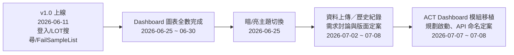
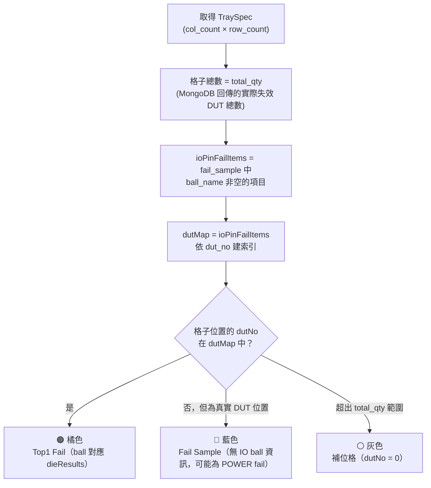
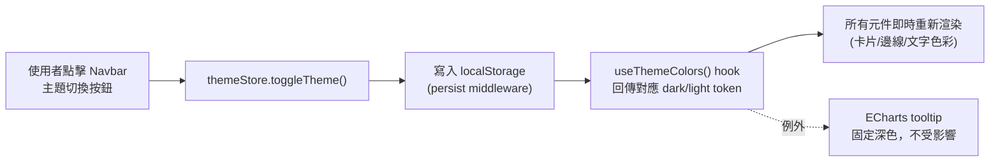
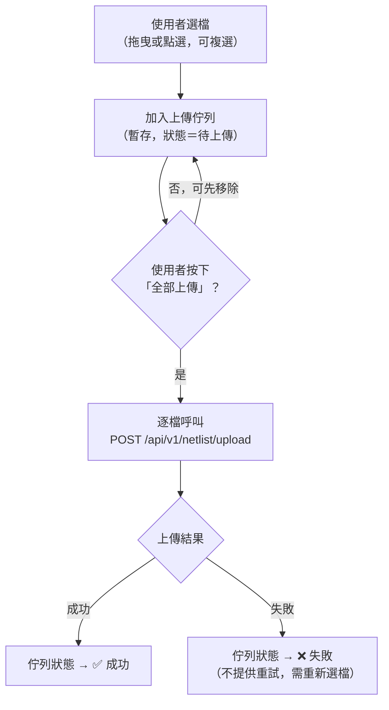
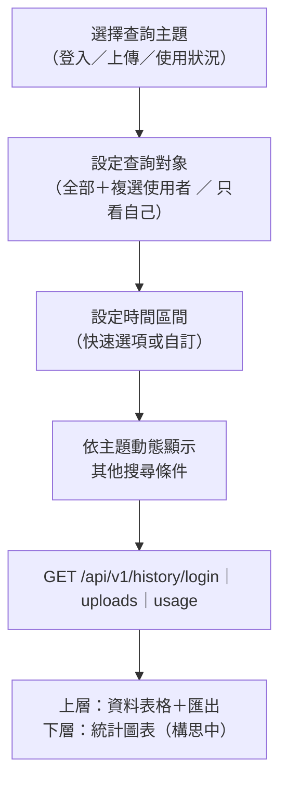
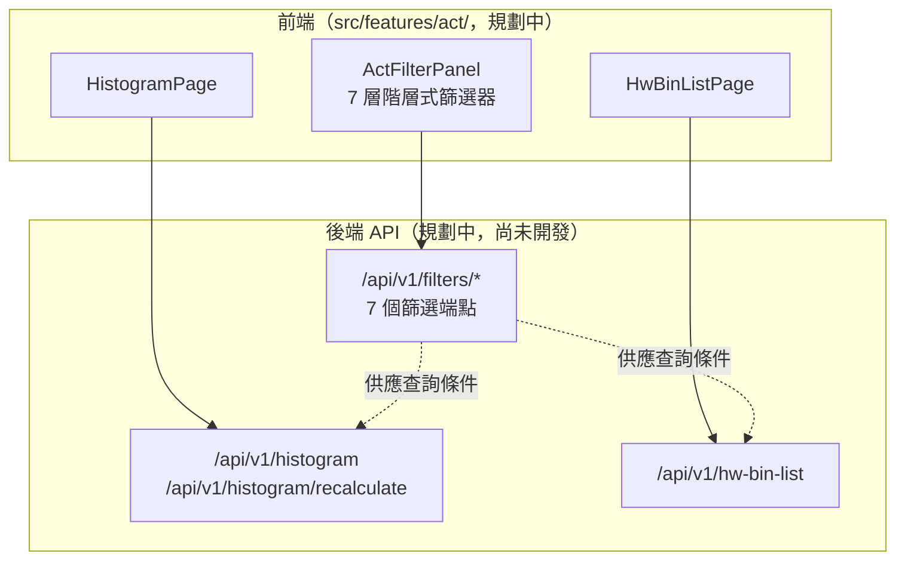

# ACT Failure Analysis System — 網頁開發報告（第二階段）

> 報告日期：2026-07-08
> 撰寫者：Dante
> 版本：v2.0（第二階段功能上線 + 第三階段規劃）
> 承接：`20260611_ACT-Frontend-Report.md`（v1.0，第一階段 Release）——本報告僅涵蓋 v1.0 之後的新進度，第一階段已完成內容（登入、LOT 搜尋、Fail Sample List、響應式版面等）請參閱前份報告，不重複列出。

---

## 目錄

1. [進度總覽](#一進度總覽)
2. [第二階段：Dashboard 圖表全數上線](#二第二階段dashboard-圖表全數上線)
3. [暗色／淺色主題切換設計](#三暗色淺色主題切換設計)
4. [系統架構更新](#四系統架構更新)
5. [規劃中功能：資料上傳與歷史紀錄頁](#五規劃中功能資料上傳與歷史紀錄頁)
6. [第三階段規劃：ACT Dashboard 模組移植](#六第三階段規劃act-dashboard-模組移植)
7. [測試說明](#七測試說明)
8. [部署現況](#八部署現況)
9. [附錄：已知限制與待辦事項](#九附錄已知限制與待辦事項)

---

## 一、進度總覽



| 階段 | 期間 | 內容 | 狀態 |
|------|------|------|------|
| 第一階段（v1.0） | ～2026-06-11 | LDAP 登入、LOT 搜尋、Fail Sample List、ResultsPanel、響應式版面 | ✅ 已上線 |
| **第二階段** | 2026-06-25 ～ 2026-06-30 | Dashboard 2×2 圖表全數完成（Fail Die／Fail Die Rate／Fail Ball／Fail Sample on Tray）、暗／亮主題切換 | ✅ 已上線 |
| 規劃中功能 | 2026-07-02 ～ 2026-07-08 | 資料上傳頁／歷史紀錄頁需求討論、版面 v2 定案 | 🔄 設計完成，待後端欄位配合後開發 |
| **第三階段（規劃）** | 2026-07-07 起 | ACT Dashboard 模組移植（Histogram + HW Bin List），API 命名定案 | ⬜ 待後端 API 就緒後開工 |

---

## 二、第二階段：Dashboard 圖表全數上線

v1.0 報告中列為「第二階段」的四張圖表，目前**已全數完成並上線**：

| 功能 | 元件 | 視覺技術 | 對應 API |
|------|------|---------|---------|
| Fail Die（疊層圖） | `FailDieChart.tsx` | Cytoscape.js 節點/邊關係圖 | `GET /netlist/programs/{test_program}/stacking-die` |
| Fail Die Rate | `FailDieRateChart.tsx` | ECharts 水平柱狀圖 | 前端依 stacking-die 資料自行計算失效率 |
| Fail Ball | `FailBallChart.tsx` | ECharts 水平柱狀圖（Top 10 Ball，IO/POWER 切換） | 前端依 fail-sample 資料自行計算 |
| Fail Sample on Tray | `FailTrayChart.tsx` | CSS Grid 位置格圖 | `GET /netlist/programs/{test_program}/tray` |

四張圖表卡片內部結構統一為：`[圖示] 標題 → 副標說明 → 分隔線 → 圖表內容`，維持一致的視覺語言。

### 2.1 Fail Sample on Tray 著色邏輯

Tray 圖是四張圖表中邏輯最複雜的一個，經過三次版本修正才確認正確計算方式：



**關鍵釐清**：在 Fail HBIN 下搜尋到的 DUT 本身即為失效品，因此「非 IO fail」的 DUT 位置一律顯示藍色（代表仍是 Fail Sample），灰色僅保留給「超出實際 Tray 數量」的純補位格，避免灰色被誤讀為「正常」。

### 2.2 Tooltip 主題處理

Dashboard 有兩種 tooltip 來源，dark/light 切換時的行為刻意不同：

| Tooltip 來源 | 使用元件 | 主題行為 |
|------|------|------|
| ECharts | FailBallChart、FailDieRateChart | 固定深色背景，不隨主題切換（避免動態切換 option 的複雜度，深色 tooltip 在兩種主題下皆清晰） |
| Ant Design `<Tooltip>` | FailTrayChart、FailDieChart | 手動傳入 `color` 與 `overlayInnerStyle`，跟隨 `useThemeColors()` 動態切換 |

---

## 三、暗色／淺色主題切換設計



| 角色 | Dark | Light |
|------|------|-------|
| 主背景 | `#0A1929` | `#F0F4F8` |
| 卡片背景 | `#112240` | `#FFFFFF` |
| 文字主色 | `#FFFFFF` | `#1A2332` |
| 主要藍 | `#1C6BD3` | `#1C6BD3`（品牌色，兩主題共用） |

> **修正（2026-07-10）**：主要藍原誤植為 `#1E88E5`，實際 `tokens.ts` 定義為 `#1C6BD3`；淺色主背景原寫「淺色背景」，補上實際色碼。完整色彩 token 定義以 `src/styles/tokens.ts` 為準，本表僅列關鍵對照，避免與程式碼失步。

---

## 四、系統架構更新

認證流程、Rolling Refresh Token 機制與 v1.0 報告內容相同，未變更，此處不重複繪製。以下僅列出**新增**的目錄與模組：

```
src/
├── hooks/
│   └── useThemeColors.ts      # ⭐ 新增：dark/light 主題色彩 hook
├── stores/
│   ├── authStore.ts
│   ├── dashboardStore.ts
│   └── themeStore.ts          # ⭐ 新增：主題切換狀態（persist）
└── features/dashboard/components/
    ├── FailDieChart.tsx       # ⭐ 新增
    ├── FailDieRateChart.tsx   # ⭐ 新增
    ├── FailBallChart.tsx      # ⭐ 新增
    └── FailTrayChart.tsx      # ⭐ 新增
```

### 已使用 API 端點總覽（累計至今）

| 端點 | 用途 | 狀態 |
|------|------|------|
| `POST /auth/login`、`GET /auth/me`、`POST /auth/refresh` | 認證與 Token 刷新 | ✅ v1.0 已上線 |
| `GET /analysis/fail-sample` | Fail Sample List（IO） | ✅ v1.0 已上線 |
| `GET /analysis/fail-sample-power` | Fail Sample List（POWER） | ✅ 第二階段新增 |
| `GET /netlist/programs/{test_program}/stacking-die` | Fail Die／Fail Die Rate 資料來源 | ✅ 第二階段新增 |
| `GET /netlist/programs/{test_program}/tray` | Fail Sample on Tray 資料來源 | ✅ 第二階段新增 |
| `GET /data/search` | 完整測試結果原始資料 | ⬜ 已定義，尚未接入任何畫面 |

---

## 五、規劃中功能：資料上傳與歷史紀錄頁

與 5920 產線人員討論後（2026-07-02 ～ 07-08），原規劃在同一頁面的「上傳」與「上傳歷史」拆分為**兩個獨立頁面**，且「歷史紀錄」範疇擴大為登入／上傳／使用狀況三主題的通用查詢頁。**目前狀態：版面與互動已定案（v2），尚未開發，部分欄位需等待後端配合。**

### 5.1 資料上傳頁（`src/features/netlist/`）

```
┌──────────────────────────────────────────────────────────────┐
│  Navbar  ACT Failure Analysis System   [使用者: A001/engineer]  │
├────────────────────┬───────────────────────────────────────────┤
│ 左欄（~280px）      │  中央內容                                  │
│ ┌────────────────┐ │  資料上傳                                  │
│ │ 上傳主題         │ │  ┌───────────────────────────────────┐  │
│ │ [Netlist     ▾] │ │  │  拖曳檔案到此處，或點擊選擇（可複選） │  │
│ └────────────────┘ │  └───────────────────────────────────┘  │
│ ┌────────────────┐ │  ⚠ 同一 test_program 上傳將直接覆蓋舊版本 │
│ │ 已上傳檔案清單    │ │  ┌───────────────────────────────────┐  │
│ │ 🔍 搜尋檔名/TP   │ │  │  上傳佇列（暫存，按「全部上傳」送出）│  │
│ │ （含上傳者資訊） │ │  │  📄 檔名A   待上傳         [✕]      │  │
│ └────────────────┘ │  │  📄 檔名B   待上傳         [✕]      │  │
│                     │  │                  [全部上傳][清空]    │  │
└────────────────────┴───────────────────────────────────────────┘
```

**互動流程**：



**設計重點**：選檔後先進佇列暫存，避免誤觸即時上傳造成資料庫無謂寫入；上傳失敗不提供重試，需重新走一次流程（避免與未來 Celery 排隊機制衝突）。

### 5.2 歷史紀錄頁（`src/features/history/`）

```
┌──────────────────────────────────────────────────────────────┐
│  Navbar  ACT Failure Analysis System   [使用者: A001/engineer]  │
├────────────────────┬───────────────────────────────────────────┤
│ 左欄（~280px）      │  中央內容                                  │
│ ┌────────────────┐ │  歷史紀錄 — 上傳紀錄        [匯出▾Excel/CSV]│
│ │ 查詢主題         │ │  ┌───────────────────────────────────┐  │
│ │ [上傳紀錄     ▾] │ │  │ 時間  使用者  Test Program  狀態    │  │
│ └────────────────┘ │  │ ...（分頁）                          │  │
│ ┌────────────────┐ │  └───────────────────────────────────┘  │
│ │ 查詢對象         │ │  ┌───────────────────────────────────┐  │
│ │ ◉全部 ○只看自己  │ │  │ 統計圖表（構思中，待後續評估）        │  │
│ │ 🔍 使用者複選    │ │  └───────────────────────────────────┘  │
│ ├────────────────┤ │                                           │
│ │ 時間區間         │ │                                           │
│ │[最近7天][最近1個月]│ │                                          │
│ ├────────────────┤ │                                           │
│ │ 其他搜尋條件     │ │                                           │
│ │（依主題動態）    │ │                                           │
│ └────────────────┘ │                                           │
└────────────────────┴───────────────────────────────────────────┘
```

**查詢流程**：



**權限規則**：`viewer` 完全看不到「資料上傳」與「歷史紀錄」兩個功能入口（主選單不顯示）；`engineer` 可見 `viewer` + `engineer` 範圍的紀錄。三個主題（登入／上傳／使用狀況）統一套用同一套規則，不依主題分岔。

### 5.3 待後端配合事項

| # | 事項 | 狀態 |
|---|------|------|
| 1 | `uploaded_by_name`（`GET /netlist/programs` 需 JOIN users 表回傳上傳者姓名） | 🔄 待後端提供 |
| 2 | 上傳失敗紀錄的 `test_program`（目前 `audit_logs.request_body` 恆為 null） | 🔄 待後端提供 |
| 3 | 歷史紀錄查詢 API（全新，三個端點） | 🔄 後端已規劃端點路徑，尚未實作 |
| 4 | 匯出 API（Excel／CSV，前端產生或後端提供尚未決定） | ⬜ 待討論 |
| 5 | 使用狀況埋點（tracking）方案 | ⬜ 完全未設計，需獨立一輪討論 |

> 完整討論脈絡見 `docs/decisions/design-decisions-qa.md` 條目 17、18；待後端事項全表見 `docs/api/frontend-contract.md` 第四節。

---

## 六、第三階段規劃：ACT Dashboard 模組移植

舊系統 `ACT_dashboard_web`（ASP.NET MVC）的 **Histogram + HW Bin List** 兩個功能模組，規劃移植至本系統，共用一組 7 層階層式篩選器（Test Program → Tester → Lot ID → Wafer ID → Test Mode → Test Item → Site）。

### 6.1 架構規劃



### 6.2 API 命名決策

原規劃將三組端點統一放在 `/api/v1/act/**` 前綴下，2026-07-08 review 時修正：**本系統整體即為 ACT 資料分析平台，`act` 前綴無法產生任何區別度**，故改依實際功能命名，與既有 `auth`／`data`／`netlist`／`analysis` 的命名慣例一致（詳見 Backend `ADR-014-act-dashboard-api-naming.md`）。

| 功能 | 端點前綴 |
|------|---------|
| 階層式篩選器 | `/api/v1/filters/*` |
| 直方圖 | `/api/v1/histogram/*` |
| HW Bin List | `/api/v1/hw-bin-list/*` |

### 6.3 待開發任務

| # | 任務 | 狀態 |
|---|------|------|
| 1 | 型別定義（FilterParams / HistogramData / HwBinListItem 等） | ⬜ 待後端端點就緒 |
| 2 | API 封裝（`src/api/act.ts`） | ⬜ |
| 3 | Zustand Store（7 層篩選共用狀態＋下游清空邏輯） | ⬜ |
| 4 | 7 層篩選器元件（串聯式 Select） | ⬜ |
| 5 | Histogram 頁面（統計資訊＋ECharts 直方圖＋自訂 X 軸重新計算） | ⬜ |
| 6 | HW Bin List 頁面（Ant Design Table 20 欄位＋Excel 匯出） | ⬜ |
| 7 | 路由與 Sidebar 選單設定 | ⬜ |

> 全部依賴後端新增對應 API，後端端點就緒前僅能先行開發型別與元件骨架。詳細任務見 `to-do-list.md` P1 區塊 #29～#35。

---

## 七、測試說明

**目前測試數量：66 tests（5 個測試檔案，全部通過 ✅，2026-07-08 實測）**

| 測試檔案 | 涵蓋範圍 |
|------|---------|
| `tests/unit/logging.test.ts` | Logger 模組（ring buffer、下載、清除） |
| `tests/unit/authStore.test.ts` | 認證 Store 邏輯 |
| `tests/unit/dashboardStore.test.ts` | Dashboard Store、快取機制 |
| `tests/unit/analysisHelpers.test.ts` | 分析文字計算邏輯 |
| `tests/components/LoginPage.test.tsx` | 登入頁元件行為 |

> **已知缺口（2026-07-08 依原始碼核對後修正）**：`FailBallChart`（`calcTopBalls()`）與 `FailTrayChart`（`buildTrayPages()`／`getCellStatus()`）的核心計算邏輯已收錄於 `analysisHelpers.test.ts` 並有測試覆蓋；但 `FailDieChart`（`calcDieFailCounts()`／`findTopFailDies()`）與 `FailDieRateChart`（`calcFailRates()`）的計算邏輯是**各自元件內部的獨立實作**，目前完全沒有對應測試，僅透過手動驗證與 build 檢查確認正確性，建議優先列入後續補強項目。

---

## 八、部署現況

部署架構、Build 流程與 IIS 設定與 v1.0 報告第五節相同，未有變更（IIS + URL Rewrite Module，`npm run build` → `dist/` → 複製至 IIS 機）。第二階段功能已包含於後續版本 build 中，部署方式不受影響。

---

## 九、附錄：已知限制與待辦事項

| 項目 | 說明 |
|------|------|
| 圖表元件測試缺口 | `FailDieChart`／`FailDieRateChart` 的計算邏輯（各自元件內部獨立實作）尚無自動化測試覆蓋；`FailBallChart`／`FailTrayChart` 的核心邏輯已由 `analysisHelpers.test.ts` 覆蓋 |
| 資料上傳／歷史紀錄開發時程 | 版面與互動已定案，但需等待後端 5 項配合事項（見第五章 5.3）到位後才能開始實作 |
| ACT Dashboard 移植時程 | 完全依賴後端新增 `/api/v1/filters`、`/api/v1/histogram`、`/api/v1/hw-bin-list` 三組 API，後端未就緒前僅能開發型別與骨架 |
| 使用狀況埋點方案 | 前端目前無任何操作事件收集機制，非單純畫面開發，需獨立一輪討論才能定案技術方案 |
| API URL 燒進 Bundle | 沿用 v1.0 已知限制，修改後端 IP/Port 後仍須重新 build |
